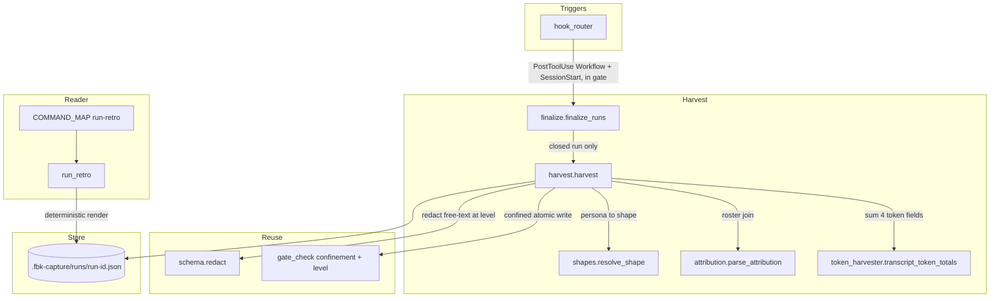

# Code Review — Observability Substrate

Post-implementation review (non-interactive path). Source of truth: `observability-substrate-spec.md` acceptance criteria (AC-01…AC-14) and user-verification steps (UV-1…UV-5).

Pre-spawn tooling: `ruff check` — clean; `mypy` — clean on all five new modules. Full suite green (518 passed) before detection.

Report naming follows the operator's stored preference (`fbk-cr-<feature>.md`, not timestamped).

## Intent Register

### Intent claims

1. `resolve_shape` returns one of exactly five vocabulary members for a known persona, and `None` for anything unknown — never an invented shape. (AC-01)
2. The attribution descriptor is read from the first transcript message only; a later forged block never overrides it; a missing/malformed block yields all-null attribution with `attribution_absent=true` and never raises. (AC-02)
3. `harvest` reads the workflow journal as the agent roster, filters `events.jsonl` to those agent ids, and emits one unit per roster agent; the join key survives a real-router round trip; two runs produce non-overlapping records. (AC-03)
4. A run with every `started` matched by a `result` is `clean-complete`; a `started` without a `result` is `truncated`, that unit flagged `journal_result_present=false` with null `journal_result`, while its attribution is independent of the missing result. (AC-04)
5. The record is written via a unique temp name then `os.replace`; a re-harvest after a run-directory mutation preserves `harvested_at` by value and leaves attributed content unchanged. (AC-05)
6. `finalize_runs` finalizes only the parsed run on `PostToolUse(Workflow)` (no sweep), sweeps the newest closed run on `SessionStart`, no-ops on any other event, and never raises into the router. (AC-06)
7. Finalization happens only for a closed run (closed-forever invariant); never on a mid-run journal balance. (AC-07)
8. `run_retro` renders per-unit fields from the record, em-dash for null, byte-identical across repeated reads, content-derived ordering, no agent invocation; missing file prints `no harvest record`, truncated/unfinalized prints a `partial record` warning. (AC-08)
9. `run-retro` is registered in `COMMAND_MAP` and `fbk.run_retro` exposes an importable `main()`. (AC-09)
10. The record carries `schema_version` and the reader tolerates an added top-level key without error. (AC-10)
11. The token accessor sums the four usage fields across an agent transcript's turns; an unreadable transcript marks `tokens_available=false` rather than recording zero. (AC-12)
12. At capture level `off` `harvest` writes no free-text record; otherwise `journal_result` and descriptor-derived free-text pass through `schema.redact()` at the resolved level before the write. (AC-13)
13. The harvest write resolves through `gate_check._real_capture_dir` (refusing a symlinked target, including a symlinked `runs/`) and uses unique per-writer temp names. (AC-14)
14. Running the conformance workflow then `run-retro` shows non-null shape/topology/persona for all three units, one single + two fan-out, one adversarial, record present after a normal close, readable after the project is moved. (AC-11 — manual UV)

### Intent diagram

## Verified Findings

### F-01: Idempotency bypassed when a finalized record exists but cannot be read

- **Location**: `fbk/harvest.py:594-611`
- **Type**: behavioral | **Severity**: major | **Origin**: introduced
- **Detection source**: spec-ac

**Mechanism**: When the existing record file is present but open/json.load raises OSError or JSONDecodeError, the except clause does `pass` and execution falls through to a full re-harvest that stamps a fresh _utcnow() harvested_at and overwrites the record via os.replace.

**Consequence**: A temporarily-unreadable or briefly-corrupt finalized record is silently overwritten with a new harvested_at, violating AC-05's preserve-by-value guarantee and IF-D-03's 'reads only the finalized flag and file existence and no-ops' invariant.

**Evidence**: except (OSError, json.JSONDecodeError): pass at ~line 610 falls through to _utcnow() and _confined_write.

**Verification**: Confirmed: os.path.isfile gate then read inside try; on OSError/JSONDecodeError the pass falls through to the timestamp+write path, producing a new harvested_at. Violates AC-05 and IF-D-03.

**Remediation**: On read failure of an existing record, return an error result rather than re-harvesting; only re-harvest when the file is absent or finalized is not true.

### F-02: SessionStart sweep harvests other projects' runs into the current project's capture dir

- **Location**: `fbk/finalize.py:152-185`
- **Type**: behavioral | **Severity**: major | **Origin**: introduced
- **Detection source**: audit-pass

**Mechanism**: _glob_run_dirs globs <projects_root>/*/*/subagents/workflows/* across ALL projects, while _is_finalized and harvest both use the current session cwd; a foreign run dir is checked against the wrong .fbk-capture/runs/ (always not-finalized) and harvested into the current project's capture dir with the current project's events.

**Consequence**: On a machine with more than one instrumented project, a session's SessionStart writes another project's run record into its own runs/ (with the wrong event data), and re-sweeps it every session because _is_finalized never finds it.

**Evidence**: sweep pattern has two unconstrained wildcards; cwd passed to _is_finalized and harvest is the current session, not the run's owning project.

**Verification**: Confirmed in finalize.py: glob spans all project hashes; _is_finalized and harvest.harvest both receive the current session cwd, so foreign runs are mis-checked and harvested into the wrong project. AC-06 has no project-isolation clause. Retrospective lists non-project-isolation as accepted scope, but it is undocumented in AC-06 and the re-sweep is real.

**Remediation**: Scope the sweep to the current project's project-hash dir, or derive each run dir's owning cwd and pass that to _is_finalized and harvest.

### F-03: PostToolUse finalize lacks a Workflow tool-name gate

- **Location**: `fbk/finalize.py:130-144`
- **Type**: behavioral | **Severity**: major | **Origin**: introduced
- **Detection source**: spec-ac

**Mechanism**: _finalize_post_tool_use never checks payload.get('tool_name') == 'Workflow'; it json.dumps the whole payload and regex-searches for subagents/workflows/<id>, so any PostToolUse for any tool whose response text contains that path triggers harvest of that run.

**Consequence**: A non-Workflow tool response that mentions a workflow path (a Read/Bash/Grep over ~/.claude/projects) finalizes a possibly still-live run, locking in a premature record and violating AC-06/AC-07's closed-only invariant.

**Evidence**: no tool_name guard before _parse_run_id_from_payload; router forwards every PostToolUse to finalize_runs (hook_router line 192).

**Verification**: Confirmed: router passes all events; finalize_runs gates only on hook_event_name==PostToolUse; _finalize_post_tool_use regex-matches any payload. A non-Workflow PostToolUse mentioning a workflow path triggers harvest of a possibly-live run. Violates AC-06/AC-07.

**Remediation**: Return early unless payload.get('tool_name') == 'Workflow'.

### F-04: OSError escapes run_retro because open() is outside the caught exception set

- **Location**: `fbk/run_retro.py:93-98`
- **Type**: behavioral | **Severity**: major | **Origin**: introduced
- **Detection source**: audit-pass

**Mechanism**: The try around open(record_path) catches only (json.JSONDecodeError, ValueError); a PermissionError on a present-but-unreadable file, or a FileNotFoundError from a TOCTOU after the os.path.exists check, propagates as an unhandled traceback.

**Consequence**: run_retro crashes with a traceback instead of the promised descriptive line, breaking its docstring guarantee 'All error conditions print a descriptive line and return without raising' under normal shared-directory permission conditions.

**Evidence**: except clause names only JSON errors; OSError subclasses uncaught; exists-then-open is non-atomic.

**Verification**: Confirmed: open() inside try but except is (json.JSONDecodeError, ValueError) only; PermissionError (chmod 000) is constructible and demonstrable -> major. Breaks the docstring no-raise guarantee.

**Remediation**: Catch OSError alongside the JSON errors, or use a single try/open catching FileNotFoundError for the no-record line and OSError for other I/O failures.

### F-05: Completeness clean-complete ignores transcript readability; spec is internally inconsistent

- **Location**: `fbk/harvest.py:669-670`
- **Type**: structural | **Severity**: minor | **Origin**: introduced
- **Detection source**: spec-ac

**Mechanism**: completeness is derived only from journal-result presence; the per-unit tokens_available flag is never consulted. AC-04's text requires only a result for clean-complete, but record-schema.md and the spec's technical-approach prose additionally require a readable transcript — so the code matches AC-04 but contradicts the schema doc.

**Consequence**: A run with all results present but an unreadable transcript is labelled clean-complete, which the schema doc says should be truncated; an operator may be misled. The root issue is a spec-internal contradiction between AC-04 and record-schema.md.

**Evidence**: completeness from results_by_agent membership only; tokens_available ignored; AC-04 vs record-schema.md line 73-76 disagree.

**Verification**: Confirmed code matches AC-04 (results-only) but contradicts record-schema.md/technical-approach (which add readable-transcript). Demonstrable by reading; classified structural/minor as it does not violate the binding AC.

*Reclassified from behavioral/major*

**Remediation**: Reconcile AC-04 with record-schema.md. If transcript-readable is intended for clean-complete, also require all units tokens_available true; otherwise correct the schema doc.

### F-06: Reader reads and prints a unit_id field absent from the record schema (dead code)

- **Location**: `fbk/run_retro.py:41-59`
- **Type**: structural | **Severity**: minor | **Origin**: introduced
- **Detection source**: spec-ac

**Mechanism**: _render_unit reads unit.get('unit_id') and conditionally prints it, but record-schema.md has no unit_id field, so the get always returns None, the conditional is always False, and the print is dead code; the conditional-omit also contradicts the null-renders-as-em-dash rule every other field follows.

**Consequence**: The _render_unit docstring falsely claims unit_id is rendered; the line never executes; if unit_id is added later it will be silently omitted on null rather than shown as an em dash.

**Evidence**: record-schema.md unit fields list has no unit_id; line reads unit.get('unit_id') and guards print with is-not-None.

**Verification**: Confirmed: no unit_id in schema; print unreachable for conformant records; docstring overclaims. Structural/minor.

**Remediation**: Remove the unit_id read and conditional print; agent_id already serves as the unit identifier.

## Findings Summary

- Sightings raised (round 1): 9 across 4 parallel Detectors (harvest, finalize+router, run_retro+init, leaf modules)
- Verified findings: 6 (4 behavioral/major, 2 structural/minor)
- Rejected: 3 — roster non-dedup (unrealistic trigger: runtime emits one started per agent), realpath-vs-write TOCTOU (outside the single-user-developer threat model), non-dict usage AttributeError (runtime never emits a non-dict usage; nit)
- False-positive rate this round: 3/9 = 33%
- Detection sources: spec-ac (F-01, F-03, F-05, F-06), audit-pass (F-02, F-04)
- Rounds to convergence: 1 thorough round (per-file targeted detectors + adversarial verification); pre-spawn ruff and mypy both clean, so no linter-sourced findings
- Pre-existing review depth (front-loaded): the breakdown was reviewed by an external GPT-5.5 pass and an Opus re-run before implementation, which is why the implementation run itself produced zero escalations; this code review found 6 residual issues those passes and the implementation gates did not surface

### Triage note

F-01, F-03, F-04, F-06 each have a small, safe, localized fix. F-02 (cross-project sweep) is the most material — it is real and is recorded in the retrospective as accepted thin-slice scope, but it is undocumented in AC-06 and causes record contamination plus endless re-sweeps on multi-project machines. F-05 is a spec-internal contradiction (AC-04 vs. record-schema.md) to reconcile, not purely a code fix.

## Remediation Status

Applied (full suite 518 passed, ruff+mypy clean on changed files):
- **F-01** — harvest now returns an error instead of re-harvesting when an existing record is present but unreadable (preserves harvested_at; aligns with IF-D-03).
- **F-03** — `_finalize_post_tool_use` returns early unless `payload.tool_name == "Workflow"`, so a non-Workflow tool response mentioning a workflow path can no longer finalize a possibly-live run.
- **F-04** — `run_retro` catches `OSError` and prints a graceful line, honoring its no-raise contract for permission/TOCTOU failures.
- **F-05** — `harvest` completeness now requires every unit's transcript to be readable (`tokens_available`) in addition to a journal result, matching record-schema.md and the technical-approach prose. (The AC-04 one-liner is the out-of-step statement; reconciling its wording is a spec edit left for the operator.)
- **F-06** — removed the dead `unit_id` read/print from the reader and corrected the docstring; the ordering test now asserts on `agent_id` (the real schema identifier), which is also what the reader sorts by.

Held for an operator decision:
- **F-02 (cross-project SessionStart sweep)** — a correct project-scoped sweep needs to map the current cwd to its `~/.claude/projects/<project-dir>` subtree, which the spec deliberately avoided ("avoiding any dependency on the undocumented project-hash algorithm"), and the sweep test fixtures use `project_hash="proj"` decoupled from cwd. Guessing the path-mangle risks silently breaking SessionStart finalization (records never finalized) — a worse failure than the current over-broad sweep. The two alternatives — (a) adopt the project-dir convention and realign the sweep fixtures, or (b) scope by intersecting each candidate run's roster with the current project's recorded agent ids — both reverse a documented design decision and/or rework fixtures. This is a design call, not a safe one-line fix, so it is surfaced rather than forced. The retrospective already records non-project-isolation as accepted thin-slice scope.
