# Spec-Driven SDL Workflow

```mermaid
%%{init: {'theme': 'dark'}}%%
flowchart TD
    classDef stage fill:#1e3a5f,stroke:#4a9eff,stroke-width:2px,color:#e0e0e0
    classDef artifact fill:#2d1b4e,stroke:#9b59b6,stroke-width:1px,color:#d4b8e8
    classDef gate fill:#1a3a1a,stroke:#4caf50,stroke-width:2px,color:#c8e6c9
    classDef compact fill:#3e2723,stroke:#ff9800,stroke-width:1px,color:#ffe0b2
    classDef feedback fill:#4a1a1a,stroke:#ef5350,stroke-width:1px,color:#ffcdd2

    start(["User request"]) --> scope{"Project or<br/>Feature?"}
    scope -->|Project| proj["Project Overview"]:::stage
    proj --> pick["Select feature"]
    pick --> s1
    scope -->|Feature| s1

    subgraph S1 [" Stage 1: Feature Spec — /spec "]
        s1["Iterative co-authoring<br/>with user"]:::stage
        s1 --> a1["feature-spec.md"]:::artifact
    end

    a1 --> g1{{"Gate 1"}}:::gate
    g1 -->|Fail| s1
    g1 -->|"Pass + user approval"| cp1["Compaction"]:::compact

    subgraph S2 [" Stage 2: Spec Review — /spec-review "]
        s2["Council classification<br/>SDL review<br/>Threat model determination"]:::stage
        s2 --> a2["review.md<br/>threat-model.md"]:::artifact
    end

    cp1 --> s2
    a2 --> g2{{"Gate 2"}}:::gate
    g2 -->|"Blocking findings"| s1
    g2 -->|"Pass + user approval"| cp2["Compaction"]:::compact

    subgraph S3 [" Stage 3: Task Breakdown — /breakdown "]
        s3["Compile spec into tasks<br/>Test + impl tasks<br/>Wave assignments"]:::stage
        s3 --> a3["task-overview.md<br/>task-01..NN.md"]:::artifact
    end

    cp2 --> s3
    a3 --> g3{{"Gate 3"}}:::gate
    g3 -->|Ambiguity| s1
    g3 -->|"Pass + user approval"| cp3["Compaction"]:::compact

    subgraph S4 [" Stage 4: Implementation — /implement "]
        wave["Wave N"]:::stage
        wave --> tsk["Test tasks in parallel"]:::stage
        tsk --> tc{{"Tests compile"}}:::gate
        tc --> imp["Impl tasks in parallel"]:::stage
        imp --> wg{{"Verify: full test suite"}}:::gate
        wg -->|Fail| rp["Re-plan<br/>max 2 attempts"]:::feedback
        rp -->|Retry| wg
        rp -->|"Max attempts"| esc(["Escalate to user"]):::feedback
        wg -->|Pass| ck["Wave checkpoint<br/>Summary + commit offer"]:::compact
        ck -->|"Next wave"| wave
        ck -->|"Final wave"| fv
    end

    cp3 --> wave
    fv{{"Final Verification"}}:::gate
    fv --> retro["retrospective.md"]:::artifact
    retro --> done(["Feature Complete"])
```



## Problem

Complex development tasks benefit from structured specification before implementation. Without this structure:

- Agents jump to implementation and miss requirements, producing rework
- No observability into agent reasoning or planning decisions
- Security and architectural concerns surface late, after code is written
- No systematic review catches ambiguity or gaps before implementation effort is spent
- Large features implemented monolithically exceed agent context limits and degrade quality

The council research (see `ai-docs/spec-workflow.md`) validates spec-driven development with empirical evidence: removing human specifications drops agent task success from 25.9% to 8.4% (SWE-bench Pro). Task decomposition into bounded units prevents the catastrophic degradation seen in long-horizon tasks.

## Goals

1. Guide user and agent through a 4-stage pipeline: **Spec** -> **Spec Review** -> **Task Breakdown** -> **Implementation** — supporting both project-level (decomposition into features) and feature-level (full pipeline) scope
2. Produce observable artifacts at each stage that serve as both audit trail and agent context for subsequent stages
3. Integrate SDL practices (threat modeling, architecture review, testing strategy, over-engineering checks) as reframed perspectives during review
4. Keep each stage's context load minimal — load only what the current stage requires
5. Make the workflow usable across any project, not coupled to a specific codebase
6. Reuse council agents as the review framework — invoke the right members for the current task, not always the full set

## Non-Goals

- Replacing simple single-pass tasks — this workflow targets complex, multi-file features
- Full CI/CD integration or deployment automation
- Prescribing specific testing frameworks or languages
- Automating the decision of when to use this workflow vs. direct implementation (the user invokes stages explicitly)

---

## Artifact Structure

The pipeline operates at two scopes:

- **Project-level**: Defines an entire system. Stage 1 produces a project overview and decomposes the project into features. Each feature then enters the pipeline independently.
- **Feature-level**: Defines a single capability. Goes through the full 4-stage pipeline (spec → review → tasks → implement).

Project-level and feature-level specs use the same `/spec` entry point. The agent recognizes scope from the user's description and adjusts its behavior accordingly.

### Feature-level artifacts

```
<proj-root>/ai-docs/<feature-name>/
  <feature-name>-spec.md          # Stage 1 output: feature specification
  <feature-name>-review.md        # Stage 2 output: review findings
  <feature-name>-threat-model.md  # Stage 2 output: feature threat model (if determination = yes)
  <feature-name>-tasks/           # Stage 3 output: compiled task specifications
    task-NN-<description>.md      # Individual executable task specs
    task-overview.md              # Dependency DAG, wave assignments, coverage map
```

### Project-level artifacts

```
<proj-root>/ai-docs/<project-name>/
  <project-name>-overview.md      # Stage 1 output: architecture, cross-cutting decisions, feature map
  <feature-a>/                    # Feature-level artifacts (full pipeline per feature)
    <feature-a>-spec.md
    ...
  <feature-b>/
    <feature-b>-spec.md
    ...
```

The project overview captures decisions that span features: technology choices, architectural patterns, shared infrastructure, and feature dependencies (which features must be completed before others can begin). It serves as persistent reference context for all feature specs within the project.

### Greenfield and brownfield

The pipeline works in both environments. The key differences:

- **Brownfield**: The agent analyzes existing code, tests, and architecture. Testing strategy references impacted existing tests. Review focuses on integration risk. Tasks modify existing files.
- **Greenfield**: No existing codebase to analyze. Testing strategy defines the testing approach from scratch (no "impacted existing tests"). Review focuses on design quality. In project-level greenfield, the first feature to emerge is often project scaffolding — build config, directory structure, test infrastructure — which goes through the pipeline and unblocks subsequent features.

Stages adapt based on what they find. The agent does not require explicit environment classification — it discovers whether existing code, tests, and architecture exist by examining the codebase.

### General artifact rules

Stages produce output artifacts. Subsequent stages read from prior outputs. Artifacts are **revisable** — when a later stage reveals issues in an earlier artifact (e.g., review finds gaps in the spec), the user returns to the earlier stage, revises the artifact, and re-runs downstream stages as needed. The pipeline is iterative, not strictly linear.

During Stage 4 wave execution, where multiple teammates work in parallel, each teammate writes only to files within its declared scope (non-overlapping scopes are guaranteed by Stage 3). The team lead writes to shared artifacts (e.g., failure summaries in the review artifact) sequentially. Stages 1-3 are single-agent work and revise their artifacts freely.

### Artifacts are shared-purpose context assets

Pipeline artifacts are not just documentation — they are **context assets consumed by agents in subsequent stages** and by humans for review, decision-making, and audit. The context asset authoring principles (`home/dot-claude/docs/context-assets.md`) apply to artifact generation, adapted for the dual audience.

**Authoring approach by artifact type**:

| Artifact | Audience | Authoring approach |
|----------|----------|-------------------|
| **Project overview** | Shared: human (architectural decisions, feature prioritization) + agents (reference context for feature specs) | Cross-cutting decisions, feature map with dependencies, technology choices. Consumed as background context, not as direct instructions. |
| **Spec** | Shared: human (co-authoring, decisions) + agents (review, compilation) | Structure for agent extraction, write for both. Predictable section headings so agents can target specific sections. Clear prose so humans can reason about trade-offs. |
| **Review findings** | Shared: human (decides next action) + agents (if revision is agent-assisted) | Structured findings with severity, category, and actionable description. Human-readable but machine-parseable. |
| **Threat model** | Shared: human (security decisions) + agents (future feature reviews against project model) | Consistent structure across features so agents can compare and extend. Clear enough for human security review. |
| **Task overview** | Shared: human (approves breakdown) + agents (team lead reads wave assignments) | Structured data (DAG, waves, traceability) that agents parse + summary prose for human review. |
| **Task files** | Agent-primary: implementation agent is the consumer. Human reviews but does not execute. | Apply the Necessity Test at maximum strictness. Direct imperatives. Every sentence must change agent behavior or prevent a mistake. No narrative explanation — only instructions and required context. |

**Structural principle**: Use predictable, consistent section headings across all artifacts of the same type. Agents locate information by heading, not by reading entire documents. A spec's "Acceptance criteria" section should always be findable at the same structural level, in the same format, across all features.

**The Necessity Test for generated artifacts**: When authoring artifact templates and generation guidance, apply the test relative to the consuming agent: "If this section were removed from the artifact, would the consuming agent be more likely to make a mistake?" Specs may include context that helps the human but is also useful for the reviewing agent. Task files should include nothing the implementation agent doesn't need.

### Project-Level Threat Model

A reusable project-level threat model lives at:
```
<proj-root>/ai-docs/threat-model.md
```

Feature-specific threat models compare against and extend this project model. The project model is actively maintained — feature reviews propose additions, removals, and modifications (a bug fix may alter part of the model). Proposed changes are reviewed and approved by the user before the project model is updated. See "Threat model maintenance" under Cross-Feature Learning.

**Threat models are sensitive.** They document assets, attack surfaces, trust boundaries, and residual risks — information that could serve as an attacker's roadmap. All threat model artifacts are excluded from version control.

**Naming convention** (deterministic, for `.gitignore`):
- Project-level: `threat-model.md`
- Feature-level: `<feature-name>-threat-model.md`

Add to `.gitignore`: `*threat-model*`

---

## Cross-Cutting: Council Agent Classification

When a pipeline stage may benefit from council input, an AI classification step determines which agents to engage and in what mode. This mirrors the council orchestrator's existing pattern: analyze the task, select agents, proceed. The user can intervene and override, but the default path is intelligent selection — not a menu.

**Classification inputs**:
- The spec content (what the feature does, what it touches)
- Project context (complexity, existing architecture, project-level threat model)
- Stage context (what kind of review is needed at this point in the pipeline)

**Classification outputs**:
- Which agents to invoke (subset of the 6)
- Invocation mode (solo, discussion, or full council)
- Brief rationale for each selection (transparent reasoning the user can evaluate)

**Council agents and their SDL lenses**:

| Agent | SDL lens | Classification signals |
|-------|----------|-----------------------|
| **Architect** | Architectural soundness, system impact, long-term vision | New system boundaries, data flow changes, integration risks |
| **Builder** | Over-engineering, pragmatism, implementation complexity | Complex technical approach, scope that could be simplified |
| **Guardian** | Testing strategy, reliability, edge cases, failure modes | Behavioral changes needing test coverage, failure-sensitive paths |
| **Security** | Threat modeling, attack surface, vulnerability patterns | Auth, data storage, external APIs, trust boundaries |
| **Advocate** | User impact, usability, scope creep from user perspective | User-facing behavior, scope that may exceed user need |
| **Analyst** | Measurable acceptance criteria, metrics, evidence-based validation | Quantifiable success conditions, claims requiring evidence |

**Invocation modes**:
- **Solo** — a single agent reviews independently. When one perspective clearly dominates.
- **Discussion** — 2+ agents review and build toward consensus. When concerns cross boundaries (e.g., security vs. usability, architecture vs. pragmatism).
- **Full council** — all 6 agents in structured discussion. When multiple classification signals fire or the feature is high-stakes.

**Where classification runs**:
- **Stage 1** — optionally, when the agent recognizes that early input (e.g., architectural feasibility) would prevent costly rework in later stages
- **Stage 2** — always, to determine which SDL review perspectives to apply
- **Stage 3** — when the task breakdown would benefit from validation (e.g., Builder on sizing, Analyst on measurability)

**Invocation mechanism**: All council invocations route through the existing `/council` skill. The classification step determines which agents to convene and frames the review prompt with SDL context. The council skill handles orchestration, logging, conflict resolution, and compaction resilience. The SDL pipeline does not reimplement any council infrastructure.

The user can also invoke council agents directly at any point — the classification step adds intelligent defaults, it does not restrict access.

---

## Cross-Cutting: Verification Gate Model

Each stage's verification gate has two layers:

1. **Structural prerequisites** (deterministic) — automated checks for presence, format, and structural completeness. Run first. Must pass before review begins.
2. **Semantic evaluation** (human or AI judgment) — quality assessment: specificity, sufficiency, clarity, correctness.

Structural prerequisites are **necessary but insufficient**. A structurally complete artifact may contain vague acceptance criteria, generic testing strategies, or unactionable findings. Passing structural checks means the artifact is ready for review — not that it is ready to advance.

**Presentation rule**: Report structural results and semantic evaluation as separate concerns. Frame structural pass as "the artifact is structurally complete and ready for review," not as a progress indicator toward the gate passing. The reviewer evaluates semantic quality independently, without anchoring to structural results.

### Enforcement mapping

Structural prerequisites are hook-enforceable — implementable as shell scripts that parse artifacts on disk. Semantic evaluation stays in skill logic where the agent applies judgment. The implementation docs (`sdl-workflow/` leaf files) specify the exact hook mechanism per stage.

| Stage | Check | Enforcement | How |
|-------|-------|-------------|-----|
| **1 (Spec)** | Required sections present and non-empty | Hook | Parse markdown for required `##` headings |
| | Open questions empty or deferred with rationale | Hook | Check section for no items, or non-empty text per item |
| | Feature map has at least one feature (project-level) | Hook | Parse for feature entries under heading |
| | AC phrasing quality | Skill logic | Judgment: "independently verifiable" is subjective |
| | Testing strategy specificity | Skill logic | Judgment: distinguishing specific from generic |
| | Technical approach sufficiency | Skill logic | Judgment: "specific enough" requires context |
| | Feature boundary quality (project-level) | Skill logic | Judgment: cohesive vs. arbitrary |
| **2 (Review)** | Findings present from all classified perspectives | Hook | Parse review doc for expected perspective headings |
| | Each finding has severity classification | Hook | Parse for severity tags (blocking/important/informational) |
| | Threat model determination recorded | Hook | Check for decision + rationale section |
| | Threat model doc exists with required sections (if requested) | Hook | File existence + heading check |
| | Testing strategy coverage entries for all categories | Hook | Parse for three categories with content or explicit "none" |
| | Blocking findings genuinely resolved | Skill logic | Judgment: is the resolution adequate? |
| | Review findings are actionable and specific | Skill logic | Judgment: distinguishing actionable from generic |
| **3 (Breakdown)** | AC IDs all appear in coverage map with test + impl tasks | Hook | Parse `task-overview.md` for AC-NN entries |
| | No circular dependencies in DAG | Hook | Topological sort on parsed DAG |
| | Wave assignments respect dependency ordering | Hook | Validate ordering against DAG |
| | Test tasks ordered before impl tasks within waves | Hook | Parse wave assignments for ordering |
| | File scope conflicts within same wave | Hook | Compare file lists across same-wave tasks |
| | File count constraint (with justification check) | Hook | Count files per task, check for justification text |
| | Every code-modifying task has a test task | Hook | Cross-reference task types |
| | Task instructions are unambiguous | Skill logic | Judgment: no deterministic test for ambiguity |
| | Task context excerpts are sufficient | Skill logic | Judgment: requires understanding what's needed |
| | Task boundaries are natural | Skill logic | Judgment: cohesive vs. artificial |
| | Impacted existing tests assigned to test tasks | Skill logic | Cross-document semantic matching |
| | Test tasks cover behavioral intent of ACs | Skill logic | Judgment: intent vs. surface assertions |
| **4 (Implement)** | Full test suite passes (per-task, per-wave) | Hook | `TaskCompleted` hook: run test runner, check exit code |
| | No new lint errors (per-task, per-wave) | Hook | `TaskCompleted` hook: run linter, diff against baseline |
| | File scope respected (per-task) | Hook | `TaskCompleted` hook: diff changed files against declared scope |
| | No uncommitted merge conflicts (per-wave) | Hook | Team lead checks after wave completion |
| | All tasks completed and individually verified (final) | Hook | Aggregate per-wave results |
| | Full test suite passes (final) | Hook | Run test runner |
| | No dead code introduced (final) | Hook | Unused-file detection (tooling-dependent) |
| | Documentation updates completed (final) | Hook | Check flagged doc files modified |
| | Implementation meets spec intent (final) | Skill logic | Judgment: aggregate result vs. spec intent |

---

## Cross-Cutting: Iteration and Convergence

The pipeline is iterative — stages can send work back to prior stages. But iteration is not unbounded. Research on AI refinement cycles establishes clear limits on when iteration helps and when it degrades quality.

### The external feedback rule

**Every iteration loop must include an external feedback signal.** If the only input to a revision is the same agent re-reading its own work, the loop is counterproductive.

Empirical basis:
- AI self-refinement without external feedback plateaus after 1-2 iterations and can actively degrade quality (Self-Refine, NeurIPS 2023; Pride and Prejudice, ACL 2024)
- Security properties degrade measurably after 5 self-refinement iterations — 37.6% increase in critical vulnerabilities (IEEE-ISTAS 2025, p << 0.001)
- Cross-perspective critique (distinct reviewers, not self-review) improves accuracy up to 27% (ICE, MedRxiv 2024)
- Adding reviewers past 2-3 shows flat returns, not diminishing ones (Porter et al.)

Valid external feedback sources: human judgment, test/lint results, a council agent with a distinct perspective, deterministic verification gates. Invalid: the same agent re-reading its own output.

### Iteration caps and convergence signals per stage

| Stage | Feedback source | Iteration limit | Convergence signal (stop when...) |
|-------|----------------|-----------------|-----------------------------------|
| **Stage 1: Spec** | Human (co-authoring) | No hard cap — the human drives iteration | User is satisfied + deterministic gate passes |
| **Stage 2: Review** | Council agents (distinct perspectives) + human judgment | 1 thorough review pass; 1 revision cycle if blocking findings arise | No blocking findings remain, or severity has shifted to minor/informational |
| **Stage 3: Tasks** | Deterministic validation + optional council | 2 compilation attempts | Deterministic gate passes |
| **Stage 4: Implementation** | Test results + lint (ground truth) | 2 re-plans per task, then escalate to user | Verification gate passes |

### One thorough pass over multiple fast passes

The software inspection literature (Russell 1991, Porter et al.) consistently shows that review quality comes from depth and pace, not repetition. A single thorough review at the right depth outperforms multiple cursory passes. This means:

- Give council agents detailed, stage-specific review prompts — not brief generic ones
- Prefer invoking 2-3 agents with thorough instructions over running 6 agents quickly
- When a review pass completes, assess findings before deciding on another pass — don't automatically re-run

### Stage transitions are human-approved, agent-facilitated

The user decides when to advance or loop back. The agent facilitates by recognizing when a stage is complete, running the verification gate, and offering to transition.

**Transition flow**:
1. The agent completes the current stage's primary work
2. The agent runs the stage's verification gate automatically
3. If the gate passes: the agent summarizes the stage output and asks the user if they'd like to proceed to the next stage
4. If the user agrees: the agent invokes the next stage's skill with the feature name, continuing the flow seamlessly
5. If the user declines: the flow pauses — the user may want to invoke council agents, revise the artifact, or step away and return later
6. If the gate fails: the agent reports what failed and works with the user to address it before offering transition again

**When a gate fails during transition**:
- The agent explains what's missing or invalid in concrete terms
- For Stage 1 gate failures: work with the user to fill gaps in the spec (still in Stage 1)
- For Stage 2 gate failures with blocking findings: ask the user whether to revise the spec (loop to Stage 1) or accept the risk with documented rationale
- For Stage 3/4 gate failures: address the specific structural or verification issue

**The agent carries context through transitions.** When invoking the next stage's skill, the agent passes the feature name so the user doesn't need to re-specify it. The transition should feel like a continuation, not a restart.

**Mid-pipeline entry is supported.** If the user invokes a stage directly (e.g., `/spec-review my-feature` on an existing spec), the agent picks up from that stage. The immediately prior stage's structural gate is checked — the agent won't skip verification just because the user entered mid-flow. (Only the prior stage, not all ancestors — if the prior stage's gate passes, it already validated its own prerequisites during its run.)

**On prior-gate failure during mid-pipeline entry**: The agent reports which gate failed and what specifically is missing or invalid. It then offers to run the failing stage to resolve it (e.g., "The spec is missing a 'Testing strategy' section. Would you like to run `/spec my-feature` to complete it?"). The user can accept, ask the agent to fix the specific issue in place, or override and proceed.

---

## Pipeline Stages

### Stage 1: Spec (`/spec`)

**Purpose**: Cooperatively design a specification through iterative dialogue between user and agent. Handles both project-level and feature-level scope.

**Entry point**: User-invocable skill. Triggered by `/spec <name>` or recognized from natural-language prompts describing a new feature, project, design task, or complex change.

**Model**: Opus or Sonnet — spec creation requires nuanced reasoning and design judgment.

**Behavior (common)**:
- If `<name>` is provided, create the artifact directory and spec file
- If omitted, ask the user for a name and brief description
- Work iteratively: draft sections, ask clarifying questions on meaningful design decisions, incorporate feedback
- Refuse to implement code — this stage produces only specification artifacts
- The user shapes the spec; the agent structures it, identifies gaps, and asks about trade-offs
- Surface open questions explicitly rather than making assumptions

#### Project-level scope

The agent recognizes project-level scope when the user describes a new system, application, or major initiative rather than a single capability.

**Behavior**: As the design is iterated, feature boundaries emerge naturally from the work. The agent identifies these boundaries and proposes decomposition — the project overview captures cross-cutting decisions, and individual features are extracted into their own specs.

**Output**: `ai-docs/<project-name>/<project-name>-overview.md` + individual feature spec files

**Project overview structure**:
1. **Vision** — what this project is and why it exists
2. **Architecture** — system-level design, major components, data flow
3. **Technology decisions** — language, framework, infrastructure choices with rationale
4. **Feature map** — identified features with brief descriptions and dependencies (which features must complete before others can begin)
5. **Cross-cutting concerns** — shared infrastructure, conventions, patterns that apply across features
6. **Open questions** — unresolved project-level decisions

**Transition from project to features**: When the user and agent agree on the feature decomposition, each feature enters Stage 1 as a feature-level spec. The project overview serves as reference context — feature specs can reference it for architectural decisions rather than re-deriving them.

#### Feature-level scope

**Output**: `ai-docs/<feature-name>/<feature-name>-spec.md`

**Spec document structure** (sections in the output artifact):
1. **Problem** — what problem does this feature solve?
2. **Goals / Non-goals** — explicit scope boundaries
3. **User-facing behavior** — what the user sees or experiences
4. **Technical approach** — architecture, data flow, key design decisions
5. **Testing strategy** — what tests this feature requires and what existing tests it affects (see below)
6. **Documentation impact** — project-scoped documents this feature affects (see below)
7. **Acceptance criteria** — verifiable conditions for "done", each independently testable. Each criterion has a short identifier (AC-01, AC-02, ...) used for traceability through task breakdown and test coverage.
8. **Open questions** — unresolved decisions captured explicitly (must be empty or explicitly deferred before Stage 2)
9. **Dependencies** — external systems, libraries, prerequisites, other features that must complete first

**Testing strategy section**: In brownfield environments, the agent analyzes the existing codebase to produce this section. In greenfield, the agent designs the testing approach for the new code. The section includes:
- **New tests needed**: unit tests, integration tests, and e2e/functional tests for the new behavior. Specify what each test validates, at what level, and which acceptance criteria (by ID) it covers.
- **Existing tests impacted** (brownfield): tests that exercise code paths this feature modifies. The agent searches the test suite for tests covering affected files, functions, and behaviors, and lists each with the expected change needed (update assertions, update fixtures, update mocks, etc.). In greenfield or when no existing tests are affected, state "None — no existing test suite" or "None — no impacted code paths."
- **Test infrastructure changes**: new fixtures, test data, mocks, or test utilities required. In greenfield, this includes bootstrapping the test framework itself if not yet established.

This section is not optional or generic. "Add unit tests" is not a testing strategy. The spec must identify specific behavioral coverage and, in brownfield environments, specific existing tests that will break or need updating.

**Documentation impact section**: The agent analyzes the project for documents this feature affects. This section is required — even "None — no project documents affected" is a valid entry that must be stated explicitly. The section includes:
- **Project documents to update**: README, architecture docs, API docs, changelogs, or other user/developer-facing documentation. For each, specify what needs to change (e.g., "Add feature entry to README feature table", "Update API docs with new endpoint"). In greenfield, this may include creating initial project documentation.
- **New documentation to create**: any new documentation artifacts this feature requires (e.g., "Create migration guide for schema changes").

Documentation updates become tasks in Stage 3, typically assigned to later waves (after implementation, since accurate docs require knowing what was actually built).

**Verification gate (feature-level)**:

Structural prerequisites (deterministic):
- All required sections present and non-empty
- Open questions section is empty or each deferred item has explicit rationale

Semantic evaluation (human judgment during co-authoring):
- Acceptance criteria are phrased as independently verifiable conditions, not vague qualities
- Testing strategy identifies specific behavioral coverage and, in brownfield, specific impacted existing tests — not generic statements ("add unit tests" fails)
- Technical approach is specific enough for review and task compilation

**Verification gate (project-level)**:

Structural prerequisites (deterministic):
- All required overview sections present and non-empty
- Feature map identifies at least one feature with description
- Open questions section is empty or each deferred item has explicit rationale

Semantic evaluation (human judgment):
- Feature boundaries are natural — each feature represents a cohesive capability, not an arbitrary split
- Feature dependencies are correct — no missing edges, no circular dependencies
- Cross-cutting decisions are sufficient for feature specs to reference

**Transition (feature-level)**: When the user signals the spec is complete, the agent runs the structural prerequisites. If they pass, the agent reports structural completeness and presents the semantic evaluation criteria for the user to assess. If the user is satisfied: "Would you like to move to spec review?" If the user agrees, the agent invokes `/spec-review <feature-name>`.

**Transition (project-level)**: When the project overview and feature decomposition are agreed, the agent asks: "Which feature would you like to spec first?" The selected feature enters Stage 1 as a feature-level spec, with the project overview as reference context.

---

### Stage 2: Spec Review (`/spec-review`)

**Purpose**: Review the completed spec through the SDL lens using council agents, each bringing a distinct analytical perspective. Produce actionable findings and a threat model.

**Entry point**: User-invocable skill. Triggered by `/spec-review <feature-name>` or recognized when a user asks to review, validate, or check a completed spec.

**Model**: Opus or Sonnet for orchestration and synthesis. Council agents use their configured models.

**Behavior**:
1. Read the spec from `ai-docs/<feature-name>/<feature-name>-spec.md`
2. Fail fast if the Stage 1 verification gate does not pass
3. Run council agent classification: analyze the spec content and project context to determine which agents to invoke and in what mode
4. Present the classification decision with rationale and proceed to invocation — the user can intervene to adjust, but the default is forward motion. (Classification is an operational decision where the AI has better signal than the user; unlike threat model determination, it does not require an active human decision.)
5. Invoke classified council agents with stage-specific review prompts — each agent reviews through its SDL lens (not generic "review this")
6. If discussion mode: agents share findings and build toward consensus on blocking issues
7. Synthesize a consolidated review document with findings organized by SDL concern
8. Run threat model determination (see below): present security summary, get active decision from user
9. Present findings to the user; blocking findings must be resolved before Stage 3 — resolution may mean revising the spec (return to Stage 1) and re-running review

**On re-run**: When the user revises a spec and re-runs Stage 2, the review document is replaced entirely. The review reflects the current state of the spec — stale findings from prior reviews create confusion. Previous reviews are recoverable from git history if needed.

**SDL review concerns and responsible agents**:

| SDL concern | Primary agent | Supporting agent(s) | Review prompt framing |
|-------------|--------------|---------------------|----------------------|
| Architectural soundness | Architect | Builder | "Evaluate the technical approach for integration risks, performance implications, and conflicts with existing architecture" |
| Over-engineering / pragmatism | Builder | Advocate | "Identify areas where the design is more complex than the requirements justify" |
| Testing strategy and impact | Guardian | Analyst | "Validate that the testing strategy covers all acceptance criteria at the appropriate level (unit, integration, e2e). Verify that impacted existing tests are identified — search the test suite for coverage of affected files and functions. Flag any acceptance criteria that lack a corresponding test plan." |
| Threat modeling | Security | Architect | "Identify trust boundaries, data flows, entry points, and threats; compare against project threat model" |
| User impact / scope creep | Advocate | Builder | "Evaluate whether each requirement serves the stated user need without unnecessary scope expansion" |
| Measurability | Analyst | Guardian | "Verify that acceptance criteria are quantifiable and that success can be measured, not just asserted" |
| Documentation impact | (deterministic) | — | Verify the spec's documentation impact section is present and specific — not "update docs" but which documents and what changes. Cross-check against the feature's scope to catch missing doc impacts. |

**Threat model determination**:

Every feature requires an active decision about threat modeling — not a passive default in either direction. Stage 2 presents a brief security summary and asks the user to decide.

1. The agent summarizes the feature's security-relevant characteristics: what data it touches, whether it crosses trust boundaries, whether it introduces new entry points or modifies auth/access control
2. The agent asks the user: "Does this feature need a threat model?" with the security summary as context
3. The user decides. Both answers are valid, but both are recorded in the review document with the user's rationale.

**If yes — full threat model**:
- Read the project-level threat model (`ai-docs/threat-model.md`) if it exists
- Security agent analyzes the feature spec for new trust boundaries, data flows, and entry points
- Architect contributes when the feature introduces new system boundaries or modifies existing ones
- Produce `<feature-name>-threat-model.md` with: assets, threat actors, trust boundaries, identified threats (STRIDE or equivalent), mitigations, residual risks
- Include a "Proposed project model updates" section: specific additions, removals, or modifications to the project-level threat model, with rationale for each change. The user reviews and approves these before the project model is updated.

**If no — documented skip**:
- The review document records the decision and rationale (e.g., "No new trust boundaries, no data handling changes, no external API interaction")
- Security concerns still surface through the normal review if the Security agent is invoked — the skip applies only to the structured threat model artifact

**Output**: `ai-docs/<feature-name>/<feature-name>-review.md` + `<feature-name>-threat-model.md`

**Verification gate**:

Structural prerequisites (deterministic):
- Review document contains findings from all classified (or user-selected) perspectives
- Each finding has a severity classification (blocking, important, informational)
- Threat model determination is recorded in the review document (decision + rationale)
- If threat model was requested: threat model document exists with required sections (assets, threat actors, trust boundaries, threats)
- Testing strategy coverage entries exist for all three categories (new, impacted, infrastructure) — empty categories have explicit "none" with justification

Semantic evaluation (human decides):
- Blocking findings are genuinely resolved — addressed in spec revision or explicitly accepted with rationale and risk owner
- Review findings are actionable and specific, not generic observations

**Transition**: After presenting findings, the agent runs structural prerequisites. If they pass, the agent reports structural completeness and presents blocking findings for the user to evaluate. If blocking findings exist: "There are N blocking findings. Would you like to revise the spec to address them, or accept these with documented rationale?" If the user resolves all blocking findings: "The review is structurally complete. Would you like to proceed to task breakdown?" If the user agrees, the agent invokes `/breakdown <feature-name>`.

---

### Stage 3: Task Breakdown — Spec Compilation (`/breakdown`)

**Purpose**: Compile the reviewed spec into individual executable task specifications — self-contained agent instructions with no remaining ambiguity.

**Entry point**: User-invocable skill. Triggered by `/breakdown <feature-name>` or recognized when a user asks to break down, decompose, or plan implementation of a reviewed spec.

**Model**: Opus or Sonnet for compilation.

**Core principle**: Tasks are not summaries or open-ended designs. They are **planned executable specifications** — compiled instructions that an implementation agent follows. Ambiguity in a task is a compilation error.

**Ambiguity as signal**: If the compiling agent cannot write clear, unambiguous context and instructions for a task, that is signal that the spec is underspecified in that area. The compiling agent stops and reports the ambiguity rather than guessing. Resolution requires returning to the spec (Stage 1) or review (Stage 2) to clarify the underspecified area before compilation continues.

**Behavior**:
1. Read the spec and review outputs from prior stages
2. Fail fast if Stage 2 verification gate does not pass
3. Compile the spec into tasks, each sized for single-agent execution. Separate test tasks (write/update tests) from implementation tasks (write the code that makes tests pass).
4. Assign tasks to parallel execution waves based on dependency analysis. Within each wave, test tasks are ordered before their corresponding implementation tasks — tests are written first, then implementation makes them pass. (See "Wave execution" in Stage 4.)
5. Assign model routing per task (Haiku for bounded single-file work, Sonnet for multi-file or architecturally significant)
6. Present the task overview to the user for review
7. Run council agent classification if the breakdown warrants validation (e.g., complex dependency chains, aggressive task sizing). Present recommendation; user can adjust or skip.
8. Revise tasks based on feedback before proceeding to Stage 4

**Task sizing constraints** (based on empirical research — see references):

File count is the sharpest predictor of agent success. Target the high-reliability zone:

| Constraint | Target | Rationale |
|-----------|--------|-----------|
| Files modified per task | 1-2 | Sharp decline above 3 files; frontier models drop to ~11% at 10+ files (FeatureBench) |
| Lines changed per task | <55 | 11x difficulty scaling from easy (<10) to hard (55+) |
| Hunks per task | 1-6 | Maps to moderate reliability zone |
| Independence | Full | Each task executes without reading other tasks or the full spec |

If a task exceeds these constraints, split it. If splitting would create artificial boundaries (e.g., a schema migration that necessarily touches 4 files), document the justification.

**Task file structure** (each `task-NN-<description>.md`):

Each task file is the complete instruction set for an implementation agent:

1. **Objective** — one sentence stating what this task produces
2. **Context** — a description of the relevant context authored by the compiling agent for the implementation agent's needs. Not raw excerpts copy-pasted from the spec or codebase — the compiling agent reads, comprehends, and writes context specific to this task. Include only what the agent needs to execute the instructions.
3. **Instructions** — step-by-step implementation instructions. Explicit enough that the agent makes no design decisions.
4. **Files to create/modify** — explicit scope boundary. The agent must not touch files outside this list.
5. **Test requirements** — new tests to write (specifying level: unit, integration, or e2e) and existing tests to update. For existing test updates: specify the test file, what changes, and why. For new tests: specify what behavior to validate and at what level.
6. **Acceptance criteria** — verifiable conditions for task completion. Each references spec acceptance criteria by identifier (AC-01, AC-02, ...). For implementation tasks, the primary acceptance criterion is: the tests written by the corresponding test task pass.
7. **Model** — Haiku or Sonnet, based on structural complexity
8. **Wave** — which parallel execution wave this task belongs to

A task file does NOT contain:
- References to "read the spec for details"
- Open design questions
- Multiple valid implementation approaches (choose one during compilation)
- Context from other tasks (each task is independent)

**Task overview** (`task-overview.md`):
- Dependency DAG showing task ordering constraints
- Wave assignments for parallel execution
- Model routing summary (Haiku vs. Sonnet per task)
- Coverage map: every spec acceptance criterion (by ID) → test task + implementation task(s)

**Output**: `ai-docs/<feature-name>/<feature-name>-tasks/`

**Verification gate**:

Structural prerequisites (deterministic):
- Every spec acceptance criterion ID (AC-01, AC-02, ...) appears in the coverage map with both a test task and an implementation task
- No circular dependencies in the task DAG
- Wave assignments respect dependency ordering
- Within each wave, test tasks are ordered before their corresponding implementation tasks
- File scope declarations don't conflict across tasks in the same wave
- No task exceeds file count constraint without documented justification
- Every code-modifying task has a corresponding test task

Semantic evaluation (human or council review):
- Task instructions are unambiguous — an implementation agent would make no design decisions
- Task context excerpts are sufficient — the agent does not need to read the full spec
- Task boundaries are natural — splits do not create artificial seams
- Impacted existing tests from the testing strategy are assigned to test tasks (cross-document matching — requires judgment)
- Test tasks cover the behavioral intent of their referenced acceptance criteria, not just surface-level assertions

**Transition**: After presenting the task overview, the agent runs structural prerequisites. If they pass, the agent reports structural completeness and presents the semantic criteria: "The task breakdown covers all spec requirements across N tasks in M waves. The structural checks pass. Would you like to review individual tasks for instruction quality, invoke council for validation, or proceed to implementation?" If the user agrees to implement, the agent invokes `/implement <feature-name>`.

---

### Stage 4: Implementation (`/implement`)

**Purpose**: Execute compiled task specifications using an agent team with dependency-ordered waves.

**Entry point**: User-invocable skill. Triggered by `/implement <feature-name>` or recognized when a user asks to implement, build, or execute a task breakdown.

**Model**: The team lead runs on the main thread (Opus or Sonnet). Per-task model routing from Stage 3 applies to teammates (typically Haiku for bounded single-file work, Sonnet for multi-file or architecturally significant tasks).

**Team setup**:
1. Read the task overview and verify Stage 3 verification gate passes
2. Create an agent team. The team lead (main thread) coordinates wave execution; teammates execute tasks.
3. Spawn teammates matching the maximum wave width. Teammates persist across waves — after completing a wave's tasks, they claim the next wave's tasks when the team lead unblocks them.

**Wave execution**:

The team lead advances one wave at a time. Within each wave, test tasks execute before implementation tasks.

For each wave:
1. Create native tasks for the wave's test tasks. Each native task's description includes the path to its task file (`task-NN-<description>.md`). Teammates claim and execute them.
2. When all test tasks complete: verify tests exist and compile (they are expected to fail — the implementation doesn't exist yet).
3. Create native tasks for the wave's implementation tasks. Teammates claim and execute them.
4. When all implementation tasks complete: run per-wave verification.
5. On verification failure: re-plan protocol (see below). The next wave does not start until all tasks in the current wave pass verification, including re-plans.
6. After wave verification passes: wave checkpoint — summarize and offer commit (see below).
7. After the final wave's checkpoint: run final verification against spec acceptance criteria.

The team lead creates native tasks wave by wave rather than all upfront. This gives the team lead explicit control over wave advancement — the next wave's tasks do not exist until the current wave passes verification and the user approves the checkpoint.

**Task isolation**: Each teammate reads its task file as the sole instruction context. The teammate does not read the full spec, other task files, or the task overview. Stage 3's verification gate guarantees non-overlapping file scopes across tasks within the same wave — this prevents concurrent-edit conflicts between teammates working in the shared directory.

**`TaskCompleted` hook enforcement**: Configure a `TaskCompleted` hook that validates per-task prerequisites before any task can be marked complete:
- Full test suite passes (not just the task's new tests)
- No new lint errors
- Changed files are within the task's declared file scope

The hook exits with code 2 (reject with feedback) when a check fails, preventing the task from completing and returning the failure output to the teammate. This makes per-task verification a platform-enforced invariant.

**Escalation from hook to re-plan**: When a `TaskCompleted` hook rejects, the teammate retries in-session using the failure output as external feedback. If the teammate cannot resolve the failure after its in-session attempts (it goes idle or messages the team lead), the team lead initiates the re-plan protocol. Hook rejections are within-session retries and do not count toward the 2-attempt re-plan cap — the cap applies only to team-lead task revisions dispatched to a different teammate.

**Per-wave verification** (structural, deterministic):

The team lead runs after all wave tasks complete:
- The **full test suite** passes — not just this wave's new tests, but all unit, integration, and e2e tests across the project. This confirms the wave's implementation satisfies its acceptance criteria (new/updated tests pass) AND did not break existing behavior (all prior tests still pass).
- No new lint errors introduced
- No uncommitted merge conflicts

The `TaskCompleted` hook catches most failures at the task level. Per-wave verification is the aggregate check that confirms no cross-task interactions created new failures.

**Wave checkpoint** (after verification passes):

After each wave's verification passes, the team lead pauses to summarize and offer the user a commit point:

1. **Summary**: What this wave accomplished — which tasks completed, what was implemented, any re-plans that occurred and why.
2. **Test results**: Which tests pass, including both new/updated tests from this wave and the full existing suite.
3. **Commit offer**: "Would you like to commit these changes before continuing to the next wave?" If the user agrees, the team lead drafts a commit message from the wave summary. If the user declines, the team lead proceeds to the next wave with changes uncommitted.

This applies to every wave including the final one. The final wave's checkpoint occurs before the final verification and retrospective.

**Final verification**:

Structural prerequisites (deterministic):
- All tasks completed and individually verified
- Full test suite passes (final confirmation — all unit, integration, and e2e tests). This is the definitive gate that the feature has been fully and cleanly implemented: updated tests confirm changed behavior works as designed, new tests confirm new behavior works as designed, and existing tests confirm nothing was broken.
- No dead code introduced (files created but unused)
- Documentation updates completed per the spec's documentation impact section (doc-update tasks in later waves)

Semantic evaluation (human review):
- Spec acceptance criteria are satisfied by the implementation — not just that tests pass, but that the aggregate result meets the spec's intent. Tests verify what was specified; human review catches what wasn't.

**On failure — re-plan protocol**:

1. The team lead collects the structured error report: which task failed, which verification check, the specific error output.
2. The team lead writes a failure summary to the feature's review artifact (`<feature-name>-review.md`), appending: which task, what was attempted, what went wrong, and what the verification output showed. This summary persists as reference for the re-plan and for the retrospective.
3. The team lead revises the task file in place (`task-NN-<description>.md`), incorporating the failure context. The original version is preserved in git history. The revised task file is the canonical version.
4. The team lead sends the revised task to an idle teammate, or spawns a replacement if no teammates are idle. The failing teammate does not retry itself — the team lead has the external signal (test/lint output) needed to make a meaningful revision. This satisfies the external feedback rule.
5. Re-plan is capped at 2 attempts per task, then escalate to user.

**Team shutdown and completion**: After all waves pass final verification, the team lead shuts down all teammates, cleans up the team, writes the retrospective artifact from data collected during execution, then summarizes: "All tasks complete and verified. Retrospective captured at `<path>`. Implementation is ready for your review."

---

## Context Asset Architecture

### Asset types and their roles

| Asset type | Role in pipeline | Why this type |
|------------|-----------------|---------------|
| **Skills** (user-invocable) | Entry points for each stage (`/spec`, `/spec-review`, `/breakdown`, `/implement`) | User controls stage transitions; description matching enables natural-language triggering |
| **Docs** (referenced) | Stage-specific instructions, classification rules, artifact templates, task sizing research | Progressive disclosure — loaded only when the relevant stage is active |
| **Council agents** (existing) | Review perspectives in Stage 2; validation in Stage 3 | Proven personas with distinct tools and authority; reused, not recreated |
| **Hooks** | Verification gates between stages; per-task enforcement in Stage 4 | Deterministic checks on stage transitions and task completion (`TaskCompleted`) |

### File layout in `.claude/`

```
.claude/
  skills/
    spec/SKILL.md                    # Stage 1 entry point
    spec-review/SKILL.md             # Stage 2 entry point
    breakdown/SKILL.md               # Stage 3 entry point
    implement/SKILL.md               # Stage 4 entry point
  docs/
    sdl-workflow.md                   # Index: routes to stage-specific docs
    sdl-workflow/
      feature-spec-guide.md          # Spec section guidance, iterative authoring patterns
      review-perspectives.md         # SDL review concerns, agent prompt framings, council reference
      threat-modeling.md             # Threat model structure, STRIDE process, project model maintenance
      task-compilation.md            # Task sizing research, compilation rules, structural constraints
      implementation-guide.md        # Wave execution, verification gates, re-plan logic, model routing
```

### Execution model

Stages 1-3 run on the main thread as single-agent work. Stage 2 spawns subagents for council reviews. Stages 1 and 3 do not spawn subagents.

**Stage 4 uses an agent team.** The team lead runs on the main thread and coordinates wave execution. Teammates are independent Claude Code sessions that each execute one task at a time in the shared working directory. This gives each teammate its own context window (no accumulated context from prior stages) while the team lead retains pipeline state.

Agent teams require the `CLAUDE_CODE_EXPERIMENTAL_AGENT_TEAMS` flag. Task files are self-contained and agent-agnostic — if the agent teams API changes or an alternative execution model becomes preferable, the artifact structure and upstream stages require no changes.

### Transition protocol

The main thread runs all stage transitions and Stages 1-3 directly, and serves as team lead for Stage 4. Context accumulates across stages. Without management, the context window fills with prior-stage conversation history, artifact content, and skill instructions — leaving insufficient headroom for later stages.

At each stage transition (after the user approves advancement):
1. The agent writes the stage's output artifacts to disk (they should already be on disk from the stage's work)
2. The agent summarizes the completed stage: feature name, artifact file paths, and any unresolved decisions
3. The agent triggers compaction before invoking the next stage's skill
4. The next stage loads fresh from its own context — the stage's doc references, not the prior stage's full content

The compaction summary carries forward only what the next stage needs to locate its inputs. Each stage's skill reads its input artifacts from disk, not from conversational context.

### Context loading per stage

Each skill loads only its stage's context. Council agents load their own persona definitions independently.

| Stage | Skill loads directly | Docs loaded on demand | Council agents |
|-------|---------------------|----------------------|----------------|
| `/spec` | `sdl-workflow/feature-spec-guide.md` | None | Classification-driven (optional at this stage) |
| `/spec-review` | `sdl-workflow/review-perspectives.md` | `threat-modeling.md` (if threat model determination = yes) | Classification-driven (always runs at this stage) |
| `/breakdown` | `sdl-workflow/task-compilation.md` | None | Classification-driven (conditional on breakdown complexity) |
| `/implement` | `sdl-workflow/implementation-guide.md` | None | None (agents execute tasks, not review) |

---

## Cross-Feature Learning

The pipeline should improve over time as features are completed. Two mechanisms:

### 1. Project threat model maintenance
The project-level threat model (`ai-docs/threat-model.md`) is actively maintained across features. Each feature review that includes a threat model proposes specific changes — additions, removals, or modifications — with rationale. The user reviews and approves proposed changes before they are applied.

Changes are not limited to additions. A bug fix may alter a previously identified threat's severity or mitigation. A refactored feature may invalidate trust boundaries or remove assets. Keeping the model accurate requires the same rigor as adding to it.

Subsequent feature reviews inherit the current threat landscape, so known patterns don't need to be re-discovered and stale entries don't provide false context.

### 2. Implementation retrospective (automatic)

After Stage 4 completes, the team lead writes a structured retrospective summarizing data already generated during execution. This is a summary of existing verification results, not an additional review pass.

**Captured data**:

Factual (no AI judgment):
- Per-task: pass/fail, re-plan count, re-plan reasons, model used (Haiku/Sonnet)
- Task sizing accuracy: actual files modified vs. declared scope, any constraint overrides
- Model routing accuracy: Haiku-assigned tasks that succeeded vs. required escalation
- Verification gate pass rates by stage
- Wall-clock time per wave (if available)

Upstream traceability (factual):
- Stage 2 review iterations before advancing (how many review cycles occurred)
- Number of blocking findings, and how many led to spec revisions (looped back to Stage 1)
- Stage 3 compilation attempts before gate passed

Failure attribution (AI judgment — evaluate for accuracy over time):
- For each re-planned task: root cause classification as **spec gap** (the spec was underspecified or ambiguous), **compilation gap** (the task instructions missed something the spec covered), or **implementation error** (the task instructions were correct but the agent failed to follow them). Based on comparing the failure output against the task file and the spec.

**Artifact**: `ai-docs/<feature-name>/<feature-name>-retrospective.md`

**Consumer**: The human. Retrospective data accumulates across features in project space. The user reviews it periodically and decides whether SDL workflow assets (which live in user space, outside the project) need adjustment. The pipeline does not self-modify its own context assets — that decision requires human judgment about whether changes are genuine improvements or maladaptive drift.

---

---

## Research References

| Source | Key finding | Citation |
|--------|------------|----------|
| METR Time Horizons | Half-life model: 80% reliability at ~1/3 of T50; Claude 3.7 Sonnet T50 ≈ 56 min | arXiv:2503.14499 |
| Toby Ord formalization | Exponential decay model for agent success vs. task duration | tobyord.com/writing/half-life |
| SWE-bench Verified stratification | Easy (<10 lines, 1 file): 80-95%; Hard (55+ lines, 2+ files): <42% | Ganhotra, April 2025 |
| SWE-bench Pro | Sharp decline above 3 files; ~11% at 10+ files for frontier models | arXiv:2509.16941 |
| FeatureBench | 790 lines/15.7 files: Claude Opus 4.5 drops from 74.4% to 11.0% | arXiv:2602.10975 |
| Agent trajectory analysis | Failed trajectories 12-82% longer than successful ones | arXiv:2511.00197 |
| M1-Parallel | 1.8-2.2x speedup with 5 parallel agents, not 5x | arXiv:2507.08944 |

**Iteration and convergence:**

| Source | Key finding | Citation |
|--------|------------|----------|
| Self-Refine | LLM iterative self-refinement: ~20% gain, concentrated in iterations 1-2 | Madaan et al., NeurIPS 2023 |
| Pride and Prejudice | Self-bias amplifies during self-refinement; models stuck at local optima | ACL 2024 |
| Security Degradation | 37.6% increase in critical vulns after 5 iterations (p << 0.001) | IEEE-ISTAS 2025 |
| ICE | Cross-model critique improves accuracy up to 27% | MedRxiv 2024 |
| Kamoi et al. | Self-correction fails without external feedback; detection is the bottleneck | TACL 2024 |
| Porter et al. | Adding reviewers past 2-3 shows flat returns | Empirical Software Engineering |
| Agile-Stage-Gate | Hard gates negatively associated with speed/cost; justified at irreversible commitments | Journal of Business Research, 2020 |
| Russell (IBM) | Review quality from depth/pace, not repetition; saturation at review rate thresholds | Russell, 1991 |

---

## Dependencies

- Context asset authoring guidelines (`home/dot-claude/docs/context-assets.md`) — all assets must conform
- Council research findings (`ai-docs/spec-workflow.md`) — architectural decisions informed by this research
- Existing council agent system (`~/.claude/agents/council/`) — personas reused, not recreated
- Existing skills ecosystem — new skills must coexist with installed skills without conflicts
- Claude Code agent teams (`CLAUDE_CODE_EXPERIMENTAL_AGENT_TEAMS`) — Stage 4 parallel execution
