# Code Review Report — agent-personas (post-implementation)

**Date**: 2026-04-18
**Feature**: agent-personas
**Branch**: feat/0.4.0-candidate-single-detector
**Source of truth**: `ai-docs/agent-personas/agent-personas-spec.md` (6 ACs)
**Preset**: behavioral-only (Groups 1-4 + Intent Path Tracer)
**Pre-review test suite**: 61/61 shell + 98/98 python — all passing

## Scope

### Modified files
- `assets/agents/fbk-council-architect.md`
- `assets/agents/fbk-council-analyst.md`
- `assets/agents/fbk-council-builder.md`
- `assets/agents/fbk-council-guardian.md`
- `assets/agents/fbk-council-security.md`
- `assets/agents/fbk-council-advocate.md`
- `assets/agents/fbk-test-reviewer.md`
- `assets/agents/fbk-improvement-analyst.md`
- `assets/fbk-docs/fbk-context-assets/agents.md`
- `tests/sdl-workflow/test-test-reviewer-agent.sh`
- `CHANGELOG.md`

### Created files
- `assets/agents/fbk-implementer.md`
- `assets/agents/fbk-spec-author.md`
- `assets/agents/fbk-task-compiler.md`
- `tests/sdl-workflow/test-council-agent-personas.sh`
- `tests/sdl-workflow/test-test-reviewer-persona.sh`
- `tests/sdl-workflow/test-improvement-analyst-persona.sh`
- `tests/sdl-workflow/test-new-persona-agents.sh`
- `tests/sdl-workflow/test-agents-md-persona-guidance.sh`

## Intent Register

### Intent claims

1. **AC-01**: `agents.md` contains a `## Persona authoring` section covering enterprise activation baseline, correctness-vs-maintainability rationale, persona structure (role activation, output quality bars, anti-defaults), personas and spawn prompts precedence, reference implementations, what not to include, and when personas are unnecessary.
2. **AC-02**: All 6 council agent files use the activation-focused pattern: role activation line, `## Output quality bars`, optional `## Anti-defaults`, optional `## Authority`. No expertise lists, communication style, personality, "How You Contribute", or "Critical Behaviors" sections.
3. **AC-03**: `fbk-test-reviewer.md` includes a persona with role activation and output quality bars. Existing checkpoint logic and evaluation criteria preserved unchanged.
4. **AC-04**: `fbk-improvement-analyst.md` includes a persona with role activation and output quality bars. Existing workflow sections preserved unchanged.
5. **AC-05**: Three new agent files exist — `fbk-spec-author.md` (read-only), `fbk-task-compiler.md` (read-only), `fbk-implementer.md` (full implementation tools) — each with activation-focused personas.
6. **AC-06**: All modified and new agents pass the persona authoring guidance's own criteria: role activation present, quality bars falsifiable, no description-heavy patterns.
7. Council agent bodies are capped at 40 lines (persona-only agents).
8. Test-reviewer and improvement-analyst persona sections are capped at 40 lines (persona section measured from body start to first existing task-logic heading).
9. Every persona grounds the agent in a professional enterprise role as baseline, then specializes.
10. Complexity-watchdog authority is preserved in Builder (technical) and Advocate (user burden) agents.
11. Frontmatter (name, description, tools) preserved byte-for-byte in modified council/existing agents.
12. CHANGELOG updated under Unreleased section (spec called for under 0.4.0 release).

### Intent diagram

```mermaid
graph TD
    subgraph "Authoring guidance"
      AMD["agents.md<br/>## Persona authoring"]
    end

    subgraph "Council agents (restructured)"
      CA1[council-architect]
      CA2[council-analyst]
      CA3[council-builder]
      CA4[council-guardian]
      CA5[council-security]
      CA6[council-advocate]
    end

    subgraph "Existing agents (persona added)"
      EX1[test-reviewer]
      EX2[improvement-analyst]
    end

    subgraph "New agent definitions"
      NEW1[spec-author]
      NEW2[task-compiler]
      NEW3[implementer]
    end

    subgraph "Reference implementations"
      REF1[code-review-detector]
      REF2[code-review-challenger]
    end

    subgraph "Structural tests"
      T1[test-council-agent-personas.sh]
      T2[test-test-reviewer-persona.sh]
      T3[test-improvement-analyst-persona.sh]
      T4[test-new-persona-agents.sh]
      T5[test-agents-md-persona-guidance.sh]
    end

    AMD -- "references as canonical pattern" --> REF1
    AMD -- "references as minimal persona" --> REF2
    AMD -- "authoring guidance shapes" --> CA1
    AMD -- "authoring guidance shapes" --> EX1
    AMD -- "authoring guidance shapes" --> NEW1

    T1 -- "validates ≤40 body + headings" --> CA1
    T1 -- "validates ≤40 body + headings" --> CA2
    T1 -- "validates ≤40 body + headings" --> CA3
    T1 -- "validates ≤40 body + headings" --> CA4
    T1 -- "validates ≤40 body + headings" --> CA5
    T1 -- "validates ≤40 body + headings" --> CA6
    T2 -- "validates persona + preserves logic" --> EX1
    T3 -- "validates persona + preserves workflow" --> EX2
    T4 -- "validates new agent files" --> NEW1
    T4 -- "validates new agent files" --> NEW2
    T4 -- "validates new agent files" --> NEW3
    T5 -- "validates 7 subsections" --> AMD
```

## Verified findings

14 verified findings across test-script quality and persona content. All behavioral correctness gates are satisfied — findings are primarily test-integrity gaps (tests that don't enforce what their labels claim) and two structural issues in persona content.

### Cluster A — Test script quality (10 findings)

**F-01 [test-integrity, major]**: No assertion that council agent bodies contain role-activation language.
- File: `tests/sdl-workflow/test-council-agent-personas.sh:51-93`
- Mechanism: Tests A-E check file existence, YAML delimiters, body length, `## Output quality bars` heading, and forbidden-heading absence. No grep for any role-activation phrase (`principal engineer`, `staff engineer`, `product manager`, etc.). A council body with no role-activation sentence would pass all 30 tests.
- Verification: test-new-persona-agents.sh Tests 7/14/21 do this correctly for new agents; test-test-reviewer-persona.sh Test 5 does it for test-reviewer. Council test is the only one missing.
- Fix: Add per-agent role-activation grep after Test D using each agent's spec-defined phrase.
- Detection sources: value-abstraction, dead-code, signal-loss (3 agents confirmed).

**F-02 [test-integrity, minor]**: Bare sentinel `999` in `body_count=${body_count:-999}` conflates missing-file with 999-line body.
- File: `tests/sdl-workflow/test-new-persona-agents.sh:65-67, 132-134, 198-200`
- Mechanism: `body_count=$(body_line_count "$FILE" 2>/dev/null)` + `body_count=${body_count:-999}` suppresses the real filesystem error, then fails with misleading `body_count=999` diagnostic.
- Fix: Remove `2>/dev/null` or rely on preceding existence test and drop the 999 sentinel.
- Detection sources: value-abstraction, signal-loss.

**F-03 [test-integrity, minor]**: Test 5 scans full body instead of persona_section for role-activation check.
- File: `tests/sdl-workflow/test-test-reviewer-persona.sh:74-79`
- Mechanism: Test 5 label is "Persona section contains role-activation language" but uses `body=$(body_lines "$AGENT")` + `grep -qi 'QA engineer'`. If "QA engineer" migrated to a task-logic section, the test would still pass.
- Fix: Replace with `persona_section "$AGENT" | grep -qi 'QA engineer'`, matching the parallel improvement-analyst test.
- Detection sources: dead-code, signal-loss.

**F-04 [test-integrity, minor]**: `test-agents-md-persona-guidance.sh` validates AC-01 subsections via scattered keyword grep, not anchored heading grep.
- File: `tests/sdl-workflow/test-agents-md-persona-guidance.sh:42-109`
- Mechanism: Tests 3-12 use `grep -qi 'enterprise'` etc. A doc with scattered keywords but no H3 subsection headings would pass all 12 tests.
- Fix: Replace with `grep -q '^### Enterprise activation as the baseline$'` and similar anchored heading checks.
- Detection sources: value-abstraction, signal-loss, intent (3 agents confirmed).

**F-05 [test-integrity, minor]**: No assertion for `## Authority` section presence for builder and advocate.
- File: `tests/sdl-workflow/test-council-agent-personas.sh:51-93`
- Mechanism: Spec explicitly assigns complexity-watchdog authority to builder and advocate. Both files contain `## Authority` sections, but their deletion would pass all existing tests.
- Adjacent: Architect's Authority section (deferral clause) is also unprotected.
- Fix: Add conditional per-agent assertion — for builder and advocate, grep for `^## Authority$` and fail if absent.
- Detection source: intent path tracer.

**F-06 [fragile, minor]**: Tools-check handles only inline YAML format; multi-line block format produces false failures.
- File: `tests/sdl-workflow/test-new-persona-agents.sh:91-102, 158-168, 225-235`
- Mechanism: `grep '^tools:'` works only for `tools: Read, Grep, Glob`. Council agents use multi-line block format (`tools:\n  - Read`). If a new agent were reformatted, all tool assertions would silently yield 0 — misleading failure message.
- Fix: Handle both formats; fall through to parse `  - Tool` lines when inline value is empty.
- Detection sources: intent, signal-loss.

**F-07 [test-integrity, minor]**: Test B validates only YAML delimiters, not required frontmatter fields.
- File: `tests/sdl-workflow/test-council-agent-personas.sh:61-68`
- Mechanism: Checks `first_line = '---'` and `grep -c '^---$' >= 2` only. `name`, `description`, `tools` field presence unchecked. test-new-persona-agents.sh already has the right pattern.
- Fix: Extract frontmatter with the existing `frontmatter()` helper and assert non-empty name/description/tools fields.
- Detection sources: value-abstraction, dead-code.

**F-08 [test-integrity, minor]**: Forbidden-heading regex anchors `'^## How You Contribute$'` and misses the actual old heading `'## How You Contribute to Discussions'`.
- File: `tests/sdl-workflow/test-council-agent-personas.sh:87`
- Mechanism: The `$` anchor requires end-of-line after "Contribute". The spec's "Current pattern" (section 4.2) shows the actual old heading includes " to Discussions". A partial revert restoring the full old heading would not be caught.
- Fix: Remove the `$` anchor — change `^## How You Contribute$` to `^## How You Contribute`.
- Detection source: dead-code.

**F-09 [test-integrity, minor]**: persona_section upper-bound test in test-test-reviewer-persona.sh measures only the preamble (~5 lines), leaving the 40-line bound effectively unenforced.
- File: `tests/sdl-workflow/test-test-reviewer-persona.sh:36-38, 66-72`
- Mechanism: `persona_section` stops at first `##` heading, which is `## Output quality bars`. The 40-line bound measures only the role-activation paragraph (~5 lines), not the full persona including quality bars. The 40-line constraint is structurally miscalibrated.
- Fix: Use `body_lines` for the upper bound (as test-council-agent-personas.sh Test C does) or redefine persona_section to include through the quality bars section.
- Detection source: intent path tracer.

**F-10 [structural, minor]**: Test 5 assertion string in `test-test-reviewer-agent.sh` misrepresents the regex by omitting `evaluate`.
- File: `tests/sdl-workflow/test-test-reviewer-agent.sh:75-83`
- Mechanism: Regex matches `reviewer|review|validate|evaluate`, but assertion string reads `"body contains agent role (test + review/validate)"`. The word `evaluate` — which is what actually matches in the persona — is absent from the label.
- Fix: Update assertion string to `"body contains agent role (test + review/validate/evaluate)"`.
- Detection source: behavioral-drift.

### Cluster B — Persona content (2 findings)

**F-11 [structural, minor]**: Builder quality bar 3 encodes an authority grant rather than a falsifiable output constraint, duplicating the dedicated `## Authority` section.
- File: `assets/agents/fbk-council-builder.md:20, 28`
- Mechanism: Quality bar 3 reads "Preserve complexity-watchdog authority: when the council converges on an elegant-sounding design, you have standing authority to demand the implementation cost be named before it moves forward." The `## Authority` section separately grants the same standing authority. Per AC-06's falsifiability test ("a reviewer can construct a specific output that violates it"), "you have standing authority" is a role grant, not an output constraint.
- Fix: Replace quality bar 3 with a falsifiable output constraint (e.g., "When the council output endorses a design without naming its implementation cost, that convergence is incomplete"). Retain `## Authority` as the sole location for the grant.
- Detection source: signal-loss.

**F-12 [structural, minor]**: Advocate quality bar 3 duplicates the `## Authority` section with authority-grant language instead of a falsifiable constraint.
- File: `assets/agents/fbk-council-advocate.md:17, 19-21`
- Mechanism: Quality bar 3 ("Preserve complexity-watchdog authority on user burden: ... you have standing authority to name the burden and demand it be justified") asserts the same authority as the `## Authority` section. Same AC-06 falsifiability issue as F-11, plus explicit text duplication.
- Fix: Replace quality bar 3 with a falsifiable output constraint (e.g., "When a council output accepts a design that increases user cognitive load without naming the burden, that output is incomplete"). Retain `## Authority` as the sole grant location.
- Detection source: signal-loss (detected as G3-S-03 and G3-S-07).

### Cluster C — Spec traceability (2 findings)

**F-13 [structural, minor]**: Spec-defined role-activation strings are hardcoded as bare literals in test files without source-of-truth annotation.
- File: `tests/sdl-workflow/test-new-persona-agents.sh:105, 172, 239`
- Mechanism: Lines 105, 172, and 239 contain bare string literals `'principal engineer'`, `'tech lead'`, `'senior engineer'` — spec-defined values drawn from spec section 4.5. If an agent's role phrase is updated per a revised spec, the test fails without any indication that the string is a spec discriminator.
- Fix: Add inline comments referencing the spec section (e.g., `# spec: agent-personas-spec.md §4.5 — role activation phrase`), or extract to named variables with a spec-reference comment block.
- Detection source: value-abstraction.

**F-14 [structural, minor]**: Forbidden-heading blocklist in `test-council-agent-personas.sh` is an inline bare compound regex without a named variable signaling its purpose.
- File: `tests/sdl-workflow/test-council-agent-personas.sh:87`
- Mechanism: The compound regex `'^## Your Identity$|^## Your Expertise$|^## How You Contribute$|^## Your Communication Style$|^## In Council Discussions$|^## Critical Behaviors$'` is assigned inline to `forbidden_pattern` with no comment linking it to spec AC-02 and no block comment listing the 6 headings individually. A future contributor extending the blocklist must understand alternation syntax and the AC-02 rationale simultaneously.
- Fix: Extract the forbidden heading list to a named variable at the top of the script with a comment referencing AC-02. Each heading can be listed individually (e.g., as an array) before being joined into the regex.
- Detection source: value-abstraction.

## Findings summary

- **Total sightings**: 33 (across 5 Tier 1 detectors + Intent Path Tracer)
- **After dedup**: 24 unique sightings
- **Verified findings**: 14 (F-01 through F-14)
- **Rejected**: 10 (4 nits, 6 rejected with reasoning below)
- **False positive rate**: 6/24 = 25% (rejections with reasoning, not counting nits)

### Rejected sightings (with reasoning)

- **Architect `## Authority` section**: Spec section 4.2 allows Authority as `(if applicable)` — the "defer to Builder and Advocate" clause is a coordination boundary statement, not a self-granted authority. No spec violation. [rejected]
- **agents.md `## Persona authoring` placement**: Spec does not mandate placement; current position (between `## Instruction Design` and `## Scope`) is editorially coherent. [rejected-as-nit]
- **agents.md `.claude/agents/...` install-path references**: Intentional per `feedback_install_paths.md` convention and satisfies `test-reference-integrity.sh`. Not a defect. [rejected]
- **CHANGELOG missing AC-06 entry**: AC-06 is explicitly a human-judgment quality gate per spec line 281, not a shippable feature. Absence is consistent with spec framing. [rejected]
- **New agents unwired from skills**: Spec Follow-up Work (lines 289-296) explicitly declares this as separate-spec follow-up. [rejected]
- **`/fbk-council` skill prompt description-heavy role injection**: Spec Non-goals (line 31) explicitly defers skill template cleanup. No AC violated. [rejected — adjacent observation logged]
- **Bare literal `40` threshold**: 6-location maintainability concern with no behavioral risk in bash test scripts. [rejected-as-nit]
- **Dead `body()` helper in `test-test-reviewer-agent.sh`**: 3-line dead helper in a test-only file; zero behavioral impact. [rejected-as-nit]
- **Case-sensitive heading grep**: Exact match on the spec's required heading phrase is correct behavior; permissive -i would be worse. [rejected-as-nit]
- **`persona_line_count` variable reuse between Test 3 and 4**: Sequential bash script under `set -u` — only a concern if tests are manually reordered. [rejected-as-nit]

## Retrospective

**Sighting counts**:
- Total sightings: 33 (7 value-abstraction + 4 dead-code + 9 signal-loss + 5 behavioral-drift + 8 intent-path)
- Verified findings: 14
- Rejected: 6 (with reasoning)
- Rejected-as-nits: 4
- Nit rejection rate: 4/33 = 12%
- Breakdown by detection source: spec-ac (12), checklist (6), intent (12), structural-target (3)
- Structural-type sub-categorization: unfalsifiable-as-quality-bar (2), bare-literals (2), dead-helper (1), description-code-drift (1)

**Verification rounds**: 1. Detectors converged immediately — no second-round spawns needed because all above-info sightings were verified or definitively rejected in round 1.

**Scope assessment**: 17 files reviewed (11 agent .md files + 5 new test scripts + 1 existing test script modification + agents.md + CHANGELOG). Pure markdown/shell content — no runtime code paths. Context usage moderate; detectors ran in parallel.

**Context health**: No cap reached. 1 round sufficient. Sightings-per-round: 33 in round 1, 0 in round 2 (not run). Rejection rate: 10/33 = 30%.

**Tool usage**: grep, file navigation via Read, bash for test execution. No project-native linters available (no shellcheck, no markdownlint).

**Finding quality**:
- False positive rate: 10/33 total rejections = 30%. Adjusting for nits (which are design choices, not detector errors): 6/33 = 18% substantive rejections.
- Breakdown by origin: all 14 verified findings are `introduced` (changes made in this feature).

**Intent register**:
- Claims extracted: 12 (6 ACs + 6 supplementary intent claims from spec structure)
- Findings attributed to intent source: 4 (F-05, F-06, F-09, plus parts of F-04)
- Intent claims invalidated: 0 (all claims held up under verification)

**Patterns observed across findings**:
1. **Missing structural-test coverage** (F-01, F-05, F-07, F-08, F-09): 5 of 14 findings are missing test assertions in test-council-agent-personas.sh or test-test-reviewer-persona.sh. The test author prioritized ceiling checks over presence checks and duplicated the omission across tests.
2. **Label/regex drift** (F-03, F-10): Test assertion strings that describe a narrower check than the regex actually performs.
3. **Quality-bar falsifiability violations** (F-11, F-12): Two council agents placed authority grants inside quality bars instead of the dedicated `## Authority` section, contradicting AC-06's falsifiability requirement.
4. **Spec-discriminator bare literals** (F-13, F-14): Spec-defined test discriminators without provenance annotation — a soft maintenance risk that may accumulate as the test suite grows.

**Retrospective summary for next iteration**: The persona-feature tests are structurally incomplete — they gate upper bounds and forbidden content but under-verify required content. A follow-up task adding role-activation, Authority-section, and frontmatter-field assertions to `test-council-agent-personas.sh` would close the highest-severity gaps (F-01, F-05, F-07). F-11 and F-12 are small content fixes to two council agents. F-02, F-03, F-04, F-06, F-08, F-09, F-10, F-13, F-14 are all minor test-quality improvements.
