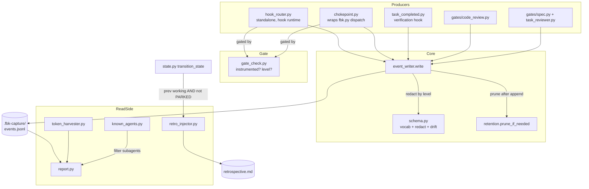

# Code Review — hook-harvesting branch vs develop/0.5.1

**Date:** 2026-06-10
**Branch:** `fbk/hook-harvesting` diffed against `develop/0.5.1`
**Source of truth:** `ai-docs/hook-harvesting/hook-harvesting-spec.md` (27 acceptance criteria, 10+3 interface contracts)
**Scope:** ~10,500 lines added across the new `fbk/capture/` subsystem, `fbk/report.py`, gate/hook/state migrations, and the installer.

---

## Pre-spawn tooling results

- **pytest:** 339 passed, 0 failed (2.18s).
- **ruff:** 10 findings repo-wide; 6 fall inside this diff:
  - `capture/chokepoint.py:116` — `redirect_installed` assigned but never used.
  - `capture/schema.py:9,10` — `glob`, `os` imported but unused.
  - `capture/token_harvester.py:243` — `readable_counts` assigned but never used (worth checking against the boundary-adjacent-turn requirement).
  - `report.py:473,474` — two f-strings without placeholders.
  - (Out of scope: `council/ralph.py`, `council/session_manager.py`, `gates/review.py`, `pipeline.py`.)

---

## Intent register

The feature gives Firebreak a deterministic metrics plane: code-written pipeline facts recorded into a shared event stream, aggregated into a report, and injected into the retrospective without agent involvement. Capture is gated to opted-in projects and is invisible to normal operation (no stdout, no broken tool calls, fail-silent).

### Key behavioral claims (from the spec's acceptance criteria)

1. **Gated capture** — in a project that is neither Firebreak-marked nor carries `.fbk-capture/capture.cfg`, the router and chokepoint record nothing and emit no output.
2. **Local-only writes** — events land in the project's `.fbk-capture/events.jsonl`, never the global config dir.
3. **Stdout-and-exit seam** — the chokepoint re-emits a command's stdout and preserves its exit code, even across a `SystemExit` raised inside `main()`, while recording one event.
4. **Verification persistence** — a `VERIFICATION_RESULT` event records failing-test count, lint-error count, and out-of-scope files; the hook's exit codes are unchanged.
5. **Code-review rounds** — a valid round-log file yields a `CODE_REVIEW_ROUNDS` event; absent → no event, unchanged pass/fail; malformed → no event plus stderr warning; values are bounded.
6. **Token harvesting** — each transcript turn is attributed to the stage active at its timestamp by a hard split; missing transcript → `unavailable`, never `0`; boundary-adjacent turn counts emitted.
7. **Report** — one table aggregating all sources with exact rate arithmetic (first-try pass rate, kill rate), not just labels.
8. **Fail-silent everywhere** — any capture write failure is caught and discarded; never fails a tool call, never writes stdout.
9. **Closed vocabulary** — every event_type is in the fixed vocabulary; drift check fails the build; out-of-vocabulary records discarded at runtime.
10. **Retention** — size-cap pruning drops oldest lines, never a locked spec's lines; locked bytes themselves capped, over-cap surfaces a report warning.
11. **Central redaction** — `standard` level carries no free-text payload, enforced once in the writer/schema, verified across all producers.
12. **Gate hardening** — Firebreak detection keys on a `.fbk-managed` sentinel, not the bare `.claude/automation/`; `full` honored only with out-of-tree corroboration; realpath-confined; symlinks refused; writer self-creates `*` gitignore.
13. **Injection predicate** — fires when previous state is a working stage AND new state is not `PARKED`; exact provenance marker; reworked stage produces a second block.
14. **Installer migration** — duplicate project-level router registration removed, unrelated hooks byte-intact, idempotent, `.fbk-capture/` gitignored.

### Intent diagram

---

## Headline

**This branch should not ship as-is.** The capture-and-record machinery (router, chokepoint, writer, gate, retention) is largely sound, but **the report — the feature's headline deliverable — renders zeros against real captured data**. Four of its core rows (gate first-try/after-rework pass rates, code-review kill rate, tasks completed/reworked, scope violations) read event keys, values, or stage fields that **no producer actually writes**. The 339-test suite stays green because every report fixture is hand-built with the keys the report *reads* rather than the keys the producers *write*, so the tests validate the report against inputs production never generates.

Net: against a real SDL cycle, an operator would open the report and see `0.00` first-try rate, `0.00` kill rate, `0` tasks, `0` scope violations, and (in mixed-transcript cycles) `0` tokens where `unavailable` was promised. The numbers the feature exists to produce are not produced.

Beyond that, there are real capture-correctness bugs (subagent completions double-counted, tool failures silently downgraded, parked/terminal stages mis-stamped), two fail-silent safety gaps that can crash a hook or drop events, and a build-time drift check that never fires.

**36 verified findings** across 3 detection rounds (29 + 5 + 2). The spec's highest-risk logic — the retrospective-injection predicate (AC-18) and the token-harvester hard-split arithmetic (AC-06) — was examined closely and is **correct**. 3 sightings were dismissed (2 nits, 1 unreachable).

Counts: **20 behavioral-major**, **13 test-integrity** (7 major, 6 minor), **2 fragile-minor**, **3 structural-minor**. Zero critical (no finding breaks the *next* run with no special input — these surface on first real use, not on a constructed edge).

---

## Findings

Grouped by theme. Each finding leads with what's wrong in plain terms; the F-id is a tag for cross-reference.

### Theme A — The report renders zeros against real data (the headline)

These four are the same shape: the report queries the event stream for a key/value/stage that the producing code never emits. Each row is therefore permanently empty in production. They are the most important findings in this review.

**F-01 — Gate pass-rate rows are always zero (behavioral, major).** `report.classify_gate_attempts` keeps `VERIFICATION_RESULT` events where `event["stage"] == <stage>`, but `task_completed.py` writes every `VERIFICATION_RESULT` with `stage=None` (it passes `None, None` for spec/stage). `None` never equals `"IMPLEMENTING"`, so the attempt list is always empty and both first-try and after-rework pass rates compute as `0.0` for every stage. This is the report's primary metric (AC-07). `report.py:47-51`, `fbk/hooks/task_completed.py:173-181`. Fix: have `task_completed` resolve and stamp the active spec/stage (the chokepoint already has this pattern), or match by timestamp window instead of an exact stage field.

**F-02 — Code-review kill rate is always zero (behavioral, major).** The report reads `data.get("raised")` and `data.get("confirmed")` from `CODE_REVIEW_ROUNDS` events, but `code_review.py` writes the keys `total_raised` and `total_survived` (there is no `raised`/`confirmed` at that level). Both default to `0`, so kill rate is always `0.0`. Separately, the report reads `data.get("rounds", 1)` expecting a count, but the producer writes `rounds` as a *list* of per-round objects. `report.py:393-399`, `fbk/gates/code_review.py:155-165` (AC-07). Fix: align the key names (`total_raised`/`total_survived`) and read `len(rounds)` for the count.

**F-03 — Scope-violation count is always zero (behavioral, major).** The report filters `event_type=="PIPELINE_COMMAND"` with `data["command"]=="scope_violation"` — a shape no producer writes. Scope violations actually live in `VERIFICATION_RESULT` events under `out_of_scope_files`. `report.py:456-460`, `fbk/hooks/task_completed.py:162-167` (AC-07). Fix: sum `len(data["out_of_scope_files"])` across `VERIFICATION_RESULT` events.

**F-04 — Tasks completed/reworked rows are always zero (behavioral, major).** The report matches `data["command"]=="task_completed"`/`"task_reworked"`, but the chokepoint writes the key `command_name` with the hyphenated value `task-completed`, and no `task-reworked` command exists in `COMMAND_MAP` at all. Both a key mismatch (`command` vs `command_name`) and a value mismatch (underscore vs hyphen). `report.py:439-448`, `fbk/capture/chokepoint.py:155`, `fbk/__init__.py` (AC-07). Fix: match `command_name=="task-completed"` with `outcome=="pass"`; derive rework from `error_history`.

**F-05 — Report fixtures fabricate the broken shapes, masking F-03 and F-04 (test-integrity, major).** `_build_full_events` constructs `PIPELINE_COMMAND` events with `data={"command":"task_completed"/"task_reworked"/"scope_violation"}` — exactly the phantom shapes the report queries, not what producers write. `test_report_renders_all_required_row_kinds` passes because the fixture matches the bug. `tests/test_report_rendering.py:104-120`.

**F-06 — Kill-rate fixture fabricates `raised`/`confirmed`, masking F-02 (test-integrity, major).** The `CODE_REVIEW_ROUNDS` fixture uses `{"raised":3,"confirmed":2}` — the report's wrong keys, not the producer's `total_raised`/`total_survived`. `tests/test_report_rendering.py:122-125`.

**F-07 — Gate-rate fixtures inject explicit stage values, masking F-01 (test-integrity, major).** The arithmetic and rendering tests build `VERIFICATION_RESULT` events with explicit non-null stage strings (`"VALIDATING"`, `"REVIEWING"`), so `classify_gate_attempts`' stage filter matches in the test — while production writes `stage=None` and the filter never matches. `tests/test_report_arithmetic.py:43,89`, `tests/test_report_rendering.py:86-97`.

> The Theme-A cluster is one underlying defect class: **producer/consumer envelope-contract drift with no test that exercises a real producer end-to-end into the report.** Recommend a single integration test that runs an actual gate/hook through the writer and then the report over the resulting `events.jsonl`, rather than hand-built event dicts.

### Theme B — Capture records the wrong thing

**F-08 — Subagent starts are counted as completions (behavioral, major).** `_EVENT_TYPE_MAP` maps both `SubagentStart` and `SubagentStop` to `SUBAGENT_STOP`; both hooks are registered, so each subagent lifecycle writes two `SUBAGENT_STOP` records. The report counts completions by that event type with no field distinguishing start from stop, inflating subagent counts ~2× (AC-16). `fbk/capture/hook_router.py:62-63`. Fix: map `SubagentStart` to `LIFECYCLE`.

**F-09 — Tool failures are downgraded to lifecycle events, dropping the tool name (behavioral, major).** `PostToolUseFailure` is registered in `settings.json` but absent from `_EVENT_TYPE_MAP`, so it falls to the `LIFECYCLE` default; `_assemble_data`'s LIFECYCLE branch does not extract `tool_name`. Every tool-call failure is recorded as generic lifecycle noise with the failed tool's identity lost (AC-12, IF-S-03). `fbk/capture/hook_router.py:59-71`, `assets/settings.json`. Fix: add `"PostToolUseFailure": "TOOL_USE"` — the existing TOOL_USE branch already extracts the right fields.

**F-10 — Pipeline commands run while parked are stamped `PARKED` instead of null (behavioral, major).** `chokepoint._resolve_spec_stage` excludes `DONE`/`FAILED` but not `PARKED`, despite its own docstring listing `PARKED` as terminal. A command dispatched while a spec is parked gets `stage="PARKED"` instead of null (AC-12). `fbk/capture/chokepoint.py:29,60`. Fix: add `"PARKED"` to the exclusion tuple.

**F-11 — The router stamps any terminal state on hook events (behavioral, major).** `hook_router._read_active_stage` returns the most-recently-modified state file's `current_state` with no terminal filtering at all, so tool-use/lifecycle events firing during idle, parked, or post-completion periods carry `DONE`/`FAILED`/`PARKED` as their stage instead of null (AC-12). Broader than F-10. `fbk/capture/hook_router.py:84-105`. Fix: return null for terminal states; share a helper with the chokepoint to keep the two in sync.

**F-12 — Per-round detail leaks at standard capture level (behavioral, major).** `FREETEXT_KEYS` lists the phantom key `round_detail`, but the code-review producer emits the per-round breakdown under `rounds`. `redact()` strips only `FREETEXT_KEYS`, so full per-round severity data survives at standard level, violating the central-redaction guarantee (AC-26). `fbk/capture/schema.py:37`, `fbk/gates/code_review.py`. Fix: put `rounds` in `FREETEXT_KEYS` (and drop the phantom `round_detail`).

### Theme C — Fail-silent and safety gaps

**F-13 — A broken capture install crashes the verification hook (behavioral, major).** `task_completed.py` does `from fbk.capture import event_writer, gate_check` as the first line of `main()` with no `try/except`. An `ImportError` propagates through `fbk.py` as an unhandled exception, exiting code 1 instead of the hook's normal 0/2 — violating fail-silent (AC-11) and potentially blocking every task completion. Every other producer wraps this import defensively. `fbk/hooks/task_completed.py:95`. Fix: move the import inside the existing `try/except` (it is already used only inside `_write_verification_event`).

**F-14 — The retention pruner silently drops events under concurrent writes (behavioral, major).** `prune_if_needed` reads the whole file then rewrites it with no lock; the writer calls it after every append and the router fires on every tool call. Once the file exceeds the 5 MB cap, a prune racing an append overwrites the appended line, and all exceptions are swallowed so the loss is invisible. `fbk/capture/retention.py:60-137`, `fbk/capture/event_writer.py:114` (AC-14). Fix: hold an `fcntl.flock` across the read-modify-write.

**F-15 — First-write capture can escape the project tree via a symlinked root (behavioral, major).** In `event_writer.write`, the branch that creates `.fbk-capture/` for the first time computes `real_root` but never uses it — it calls `os.makedirs` with no confinement check, unlike the existing-dir branch. If the project root is reached through a symlink, the directory and its files are created outside the real tree (AC-23). `fbk/capture/event_writer.py:79-88`. Fix: apply the same `realpath`/`startswith` checks before `makedirs`.

**F-16 — The task-reviewer gate writes no event when it fails (behavioral, major).** `event_writer.write` sits only in the pass branch; the fail branch calls `sys.exit(2)` with nothing recorded. The spec requires each gate to write on pass *and* fail; the spec gate does both. Task-reviewer failures (normal when coverage is short) never reach the stream, skewing any gate-rate derived from it (AC-05). `fbk/gates/task_reviewer.py:340-359` vs `fbk/gates/spec.py:307-352`. Fix: add a fail-path write before `sys.exit(2)`.

**F-17 — Round-log validation accepts JSON booleans as counts (behavioral, major).** `not isinstance(raised, int)` passes for `bool` (a subclass of `int`), so `{"raised":true,"survived":false}` is accepted as `1`/`0` with no malformed warning — a trust-boundary gap, since an agent-written file feeds a deterministic gate (AC-27). `fbk/gates/code_review.py:68`. Fix: `isinstance(x, int) and not isinstance(x, bool)`.

### Theme D — The schema drift check never fires

**F-18 — The drift-check regex cannot match any producer (behavioral, major).** `check_drift` looks for `event_type=`/`event_type:` and `build_event(` patterns, but every producer passes the event type as the first positional argument to `event_writer.write("TYPE", ...)`. No producer matches either pattern, so `check_drift` always returns empty — the AC-13 "build fails on drift" guarantee is inert. `fbk/capture/schema.py:87-90`. Fix: add a pattern for `event_writer.write(` with a quoted first argument.

**F-19 — The drift-check test only scans `fbk/capture/` (test-integrity, major).** The sole drift-failing test points at `fbk/capture/`, but the producers live in `fbk/gates/` and `fbk/hooks/`. Even with the regex fixed, drift in a gate or hook would never be scanned. `tests/test_capture_schema.py:54-68`. Fix: scan the whole `fbk/` package.

### Theme E — Required report outputs are missing (AC-06)

**F-20 — Tokens read `0` instead of `unavailable` in mixed-transcript cycles (behavioral, major).** When any transcript is readable, `harvest` marks *every* stage available (the inner loop adds all stage names unconditionally), so a stage whose turns were only in an *unreadable* transcript shows `tokens in=0 out=0` instead of `unavailable` — defeating the unavailable-vs-zero distinction the spec is built around. `fbk/capture/token_harvester.py:268-270`. Fix: mark a stage available only when a turn is attributed to it from a readable transcript (the dead `readable_counts` dict at line 243 was the intended mechanism — F-34).

**F-21 — Boundary-adjacent turn counts and the coarse-indicator label are never rendered (behavioral, major).** The harvester computes `boundary_adjacent_turns` per stage, but the report prints only token totals and carries no "coarse indicator" label — both explicit AC-06 requirements — so operators may over-trust cross-cycle token comparisons. `fbk/capture/token_harvester.py:311`, `fbk/report.py:477-488`. Fix: render the count and add the label.

**F-22 — The required-row-label test omits boundary-adjacent, hiding F-21 (test-integrity, minor).** `_REQUIRED_ROW_LABELS` has no entry for the boundary-adjacent/coarse output, so the rendering test passes despite the missing rows. `tests/test_report_rendering.py:49-60`.

### Theme F — Other non-enforcing / phantom tests

**F-23 — The task-reviewer envelope test has no fail-path case (test-integrity, major).** The class tests only pass-path and write-failure-silence, so F-16 ships undetected. `tests/test_gates_task_reviewer.py:392-497`.

**F-24 — The failing-count assertion can't tell a count from a flag (test-integrity, major).** `assert failing_count >= 1` is satisfied by the always-`1` sentinel the code emits (see F-25), so AC-04's count requirement has no real coverage. `tests/test_hooks_task_completed.py:333-339`.

**F-25 — `failing_test_count`/`lint_error_count` are binary 0/1, not counts (behavioral, major).** Both are set unconditionally to `1` on any failure; the runner output is captured but never parsed for a number. 1 failing test and 50 failing tests produce identical events (AC-04). `fbk/hooks/task_completed.py:111-132`. Fix: parse the runner/linter summary for the real count.

**F-26 — The chokepoint normal-return path has no coverage (test-integrity, major).** The integration tests claim to exercise the normal-return (int-return) seam but drive `fbk.py state transition`, which always raises `SystemExit` — so the `return exit_code` path (used in production by `report` and any int-returning command) is never hit. `tests/test_capture_chokepoint_integration.py`, `fbk/capture/chokepoint.py:129-131,190`. Fix: drive a command whose `main()` returns an int without `sys.exit` (e.g. `report`).

**F-27 — Empty-identity subagent test accepts a dropped field (test-integrity, minor).** The assertion `agent_val == "" or agent_val is None` passes even if `agent_type` is absent entirely, though the test claims the empty string is *preserved*. `tests/test_capture_hook_router.py:204-207`.

**F-28 — Subagent-count test depends on the ambient agent install (test-integrity, minor).** It never sets `FBK_AGENTS_DIR`, so it passes via the hardcoded fallback whether the persona scan succeeds or fails — it never exercises the parameterizable scan root AC-16 requires. `tests/test_report_arithmetic.py:294-333`.

**F-29 — A zero-substitution guard splits on a character the report never emits (test-integrity, minor).** `line.split("|")` in the unavailable-rendering test can never produce a `"0"` cell because the report has no pipes; the guard is illusory (the primary assertion still covers the case). `tests/test_report_rendering.py:294-300`.

**F-30 — The migration test masks a `ROUTER_ANCHOR` regression (test-integrity, minor; downgraded from major).** It calls `merge_settings` then a second `remove_hook_command` with a different anchor that also contains `hook_router.py`, so a broken `ROUTER_ANCHOR` would still pass. A sibling test (`...WithoutSeparateRemovalCall`) does cover the regression, so this is a redundant weak test, not an uncovered gap. `tests/test_install_migration.py:106-135`.

**F-31 — The dispatcher test verifies `session-state` only by count (test-integrity, minor; pre-existing).** The named-command set omits `session-state`; the `len==19` check covers it only numerically, so removing it and adding another command would pass. `tests/test_dispatcher.py:25-58`.

### Theme G — Structural and fragile (minor)

**F-32 — STALE_FALLBACK warning is read before the scan that sets it (fragile, minor).** `_print_warnings` reads `known_agents.STALE_FALLBACK` before `count_known_subagents` runs the scan that mutates it, so a scan that fails during the run (but succeeded at import) silently omits the AC-16 warning. `fbk/report.py:346,380,491`. Fix: print warnings after the count.

**F-33 — `UserPromptSubmit` (and `Notification`) lack explicit map entries (fragile, minor).** Registered but absent from `_EVENT_TYPE_MAP`, they fall to the `LIFECYCLE` default. No data is corrupted, but the implicit classification is a maintenance trap (and `PrePrompt`/`PostPrompt` are in the map but not registered — dead entries). `fbk/capture/hook_router.py:59-71`.

**F-34 — `readable_counts` is built but never used (structural, minor).** Dead per-stage tracker whose comment describes the fix for F-20. `fbk/capture/token_harvester.py:242-243`.

**F-35 — `schema.py` imports `glob` and `os` but uses neither (structural, minor).** `check_drift` uses `pathlib`. `fbk/capture/schema.py:9-10`.

**F-36 — Unreachable `remaining_budget < 0` guard in the pruner (structural, minor).** After ceiling enforcement, `remaining_budget` is always ≥ 50 % of the cap with `PROTECTED_FRACTION=0.5`. `fbk/capture/retention.py:103-108`.

---

## Dismissed sightings

- **`redirect_installed` dead variable** (chokepoint) — rejected as a nit. The `finally` restores stdout unconditionally and is correct; the variable is harmless dead code.
- **Tautological `len(attempts) > 0`** (report-arithmetic test) — rejected as a nit. The real rate assertion on the same path provides the enforcement.
- **Empty event arrays from `remove_hook_command`** — rejected. The orphaned-empty-array path requires a pre-existing registration for an event absent from the new template; the prototype only ever shipped events the template now covers, so it is unreachable from any real install state.

---

## Findings summary

| Metric | Value |
|--------|-------|
| Detection rounds | 3 (29 + 5 + 2 verified) |
| Verified findings | 36 |
| Dismissed (nit / rejected) | 3 |
| False-positive rate (this review) | 3/39 ≈ 7.7% |
| Behavioral-major | 20 |
| Test-integrity (major / minor) | 7 / 6 |
| Fragile-minor | 2 |
| Structural-minor | 3 |
| Critical | 0 |

By detection source: spec-ac 14, audit-pass 16, structural-target/checklist 4, linter 2.
Confirmed correct (examined, no finding): retrospective-injection predicate (AC-18), token-harvester hard-split attribution and boundary window (AC-06).

### Severity reading

No finding is `critical` because none breaks the *next* run with no special input — but that classification understates the impact here. The four Theme-A findings (F-01 to F-04) are each individually `major` by the observability rule (you need real captured data, not a constructed input, to see them), yet *together* they mean the report's headline numbers are uniformly wrong on first real use. Treat Theme A as release-blocking despite the per-finding severity.

## Retrospective

**What the review surfaced.** The capture *write* path (router → gate → writer → stream, plus retention and redaction) is well-built and well-tested; most of its findings are edge cases (symlink first-write, concurrent prune, terminal-stage stamping). The *read* path (report) is where the feature breaks: it was written against an idealized event shape that diverged from what the producers actually emit, and the divergence was invisible because every report test hand-builds events in the report's expected shape. This is the classic AI-codegen failure mode — plausible code on both sides of an interface that never meet — amplified by tests that encode the same wrong assumption on both sides.

**The load-bearing pattern.** Producer/consumer envelope-contract drift (`command` vs `command_name`, `raised` vs `total_raised`, `stage` value vs `stage=None`) with no end-to-end test that runs a real producer into the report. Six of the 36 findings are this one pattern (F-01–F-04 behavioral + F-05–F-07 the masking tests). The single highest-value remediation is one integration test: run an actual gate and an actual task-completion through the writer, then run `report` over the resulting `events.jsonl`, and assert non-zero rows. That test would have failed on day one and caught all six.

**Method notes.** Round 1 (5 parallel detectors over the whole change) found the broad set but, being file-scoped, each detector saw only its side of the producer/consumer contract — the foundation detector flagged the `round_detail` redaction key mismatch, but no single detector connected the report's read keys to the producers' write keys. Round 2, seeded with round 1's `command`/`command_name` finding and told to audit *every* report row against its producer, found the systemic cluster (kill rate, gate rates). The lesson: cross-cutting contract bugs need a detector explicitly tasked with tracing both ends, not just file-local review. Round 3 confirmed the remaining thin areas and came back nearly clean (one localized router-map gap), which is the convergence signal.

**False positives.** 3 of 39 (7.7%) — two style nits the detectors over-weighted, one unreachable-path structural. The challenger correctly downgraded one test-integrity finding (F-30) from major to minor on finding a sibling test that covers the regression. No verified finding was later found wrong.

**Documentation drift not assessed.** Per the agreed scope (shipping code only), `docs/architecture-overview.md` and `docs/decisions-log.md` edits on this branch were not reviewed; if those describe the report as producing these metrics, they will need reconciling once the read-path bugs are fixed.
