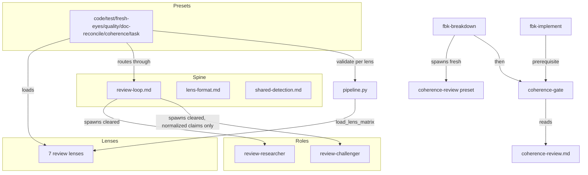

# Code Review — unified-review-shape

**Date:** 2026-06-23
**Branch:** fbk/unified-review-shape (`eb10ee2..23d1015`)
**Source of truth:** `ai-docs/unified-review-shape/unified-review-shape-spec.md` (20 ACs)
**Preset:** behavioral-only · **Severity threshold:** minor

## Scope

Post-implementation review of the unified-review-shape feature. Reviewable units:
- **Production Python** — `pipeline.py` (normalize, load_lens_matrix, LensVocabulary, validate_against_mode, validate_sighting vocab param), `gates/coherence.py` (new), `shapes.py`, `capture/known_agents.py`, `__init__.py` (COMMAND_MAP).
- **Context-asset contracts** — seven review lenses, review-loop/lens-format/shared-detection docs, two role agents, six migrated preset SKILL.md files, two new presets, breakdown/implement wiring.

## Pre-spawn tooling

- `py_compile`: clean on all production modules.
- `ruff check`: one finding — `F541` extraneous f-prefix on a non-interpolated string, `pipeline.py:141` (nit, pre-existing line touched by the refactor).
- `mypy`: clean (no issues in 4 production modules).
- Full pytest suite: 650 passing, 0 failing.

## Intent register (from spec ACs)

Behavioral claims under review:
1. The code-review round-log allowlist still projects only `raised`/`survived`/enum-`severity`, stripping `round` and `severity_breakdown` at the trust boundary (AC-01).
2. Code review writes its findings report and `.code-review-rounds.json` at the same paths/format as before (AC-02).
3. `pipeline.normalize()` returns exactly six allowlisted fields, folds location into evidence, strips all framing (AC-05).
4. An unresolvable lens path raises a named error containing the path; never a silent default-vocabulary fallback (AC-06).
5. `validate_sighting(finding, vocab)` validates against a per-lens vocabulary; the no-vocab default is behavior-identical to before (AC-16).
6. Scan-mode presets (quality-scan, doc-reconcile, fresh-eyes) bypass `validate_sighting()`; a record the finding-validator would reject survives the scan path; finding-mode still validates (AC-18).
7. The coherence gate passes only when `coherence-review.md` exists and its final `Verdict:` line is `accepted`; absent file or non-accepted verdict fails (AC-08/09/10).
8. `coherence-gate` is registered in COMMAND_MAP and resolves to `fbk.gates.coherence` (AC-08).
9. Telemetry resolves `review-researcher`/`review-challenger` to the `review` shape; the four superseded domain agents have zero callers across active assets (AC-13).
10. Each migrated preset routes through the shared review-loop spine; verdict/artifact contracts unchanged (AC-01..04, AC-17).

### Intent diagram

---

## Verified findings

One detection-verification round across two parallel units (production Python; context-asset contracts). 13 sightings raised, 7 verified, 6 rejected (3 by-design, 3 nits). The challengers rejected the headline "per-lens validation is dead-wired" cluster (S-01/02/03) after reading the spec: orchestration is intentionally prose, and the per-lens callables exist as unit-tested building blocks a prose agent invokes — the absence of a CLI caller is the documented architecture, not a defect.

### Broken references to deleted/unmigrated files (3 — behavioral, major)

These slip past the migration's own AC-13 zero-caller test because that grep is scoped to `assets/skills/**` and `assets/agents/**`, while these references live under `assets/fbk-docs/**`.

- **F-01 — `review-loop.md` cites a nonexistent `overview.md`.** Step 3 of the loop tells the coordinator to "see seam 2 in overview.md" for the normalization/isolation contract. No `overview.md` exists in the installed lens directory — it was a design-phase page never migrated. An agent following the pointer to confirm the six-field isolation allowlist (AC-05/IF-S-02) hits a dead end. *Fix: replace the pointer with the inline isolation-invariant rule already in review-loop.md, or the IF-S-02 contract.*
- **F-02 — `corrective-workflow.md` references the deleted `fbk-test-reviewer` agent.** Cites `.claude/agents/fbk-test-reviewer.md, Criterion 3`; that file was deleted in the terminal migration. *Fix: repoint to `test-lens.md` (which now carries the criteria) and widen the AC-13 grep scope to `assets/fbk-docs/**`.*
- **F-03 — `agents.md` names the deleted `fbk-code-review-detector`/`fbk-code-review-challenger` as canonical examples.** Both files were deleted; the live concise-persona examples are `fbk-review-researcher`/`fbk-review-challenger`. The guidance content still applies — only the filenames are stale. *Fix: repoint to the surviving generic agents.*

### Contract mismatches in the migrated assets (4)

- **F-04 — spec-review test-review handoff spawns no challenger (behavioral, major).** `fbk-spec-review/SKILL.md` spawns only `review-researcher` in spec-checkpoint mode; no `review-challenger` appears anywhere in the skill. The spec migrates test-review to 1 researcher / 1 challenger and states test review "now runs an independent challenger before its verdict" across all three modes. As shipped, the spec-checkpoint verdict is researcher-only — the find-only behavior the unified shape exists to replace. The council-document exclusion (IF-S-08) only excludes the council *document* from spawn materials; it does not make the instance researcher-only. **This one carries genuine intent ambiguity — flag for author decision.**
- **F-05 — code-review loop status enum omits `unresolvable` (fragile, minor).** `fbk-code-review/SKILL.md` step 5 lists four legal challenger statuses (verified / verified-pending-execution / rejected / rejected-as-nit). The shared spine adds a fifth, `unresolvable` (review-loop.md, the challenger persona, IF-S-03/AC-07), reachable in code review when a cited source can't be located. An `unresolvable` verdict would be treated as out-of-enum or dropped. *Fix: add `unresolvable` to the enumeration and define how the loop records it (surfaced as unadjudicated, not filtered as verified).*
- **F-06 — quality-lens gate floor contradicts the at-most-five contract (fragile, minor).** `quality-lens.md` states the Severity-line count "must be at least 1 and at most 5"; AC-17/IF-S-10 (and the same lens elsewhere) say only "at most five." A clean change set with zero opportunities yields zero Severity lines and would fail this floor. The `>= 1` floor also leaked into the conformance test (`test_scan_preset_outputs.py`). *Fix: change the bound to "at most 5" (zero permitted), and reconcile the test + AC.*
- **F-07 — `normalize()` emits `None` (not `""`) for `source_of_truth_ref` when absent (fragile, minor).** IF-S-01 says the field is empty when a finding comes from general lens knowledge; the cmd_validate path coerces to `""` via DEFAULTS but `normalize()` bypasses that, emitting `None`. Low impact (feeds a prose challenger spawn), and the unit test always populates the field so it isn't caught. *Fix: default the stripped fields to `""`.*

## Findings summary

| ID | Type | Severity | Where | One-line |
|----|------|----------|-------|----------|
| F-01 | behavioral | major | review-loop.md | dangling `overview.md` reference |
| F-02 | behavioral | major | corrective-workflow.md | references deleted `fbk-test-reviewer` |
| F-03 | behavioral | major | agents.md | references deleted detector/challenger |
| F-04 | behavioral | major | fbk-spec-review/SKILL.md | test-review handoff has no challenger |
| F-05 | fragile | minor | fbk-code-review/SKILL.md | status enum omits `unresolvable` |
| F-06 | fragile | minor | quality-lens.md | `>=1` floor contradicts at-most-five |
| F-07 | fragile | minor | pipeline.py `normalize()` | `None` vs `""` for absent field |

- **Sightings:** 13 raised · 7 verified · 6 rejected (3 by-design, 3 nits) · false-positive rate 46% (high, driven by the unwired-validation cluster the challenger correctly read as by-design).
- **Pattern across F-01..F-03:** the AC-13 zero-caller grep under-scopes — it never checked `assets/fbk-docs/**`, so three live broken references to deleted agents/pages survived the migration's own no-break test. This is the highest-leverage fix: widen the grep.

## Fixes applied

All seven verified findings fixed (delegated to isolated agents on disjoint file sets); full suite **650 pass** after fixes.

- **F-01** review-loop.md — dangling `overview.md` pointer replaced with the inline isolation-invariant rule.
- **F-02** corrective-workflow.md — repointed `fbk-test-reviewer.md` citation to `test-lens.md` (pre-lock section).
- **F-03** agents.md — repointed deleted detector/challenger examples to `fbk-review-researcher`/`fbk-review-challenger`.
- **F-04** fbk-spec-review/SKILL.md — spec-checkpoint test-review now spawns researcher **and** challenger (1/1, cap 5) over the shared spine, council-document exclusion preserved (operator-confirmed as a real defect).
- **F-05** fbk-code-review/SKILL.md — `unresolvable` added to the step-5 status enum, recorded as an unadjudicated finding.
- **F-06** quality-lens.md + test_scan_preset_outputs.py — floor corrected to "at most 5, zero permitted"; the `>=1` assertion removed from the conformance test.
- **F-07** pipeline.py `normalize()` — framing-stripped fields default to `""`, matching the cmd_validate path.
- **Grep widening** — the zero-caller test (`test_removed_agents_zero_callers.py`) now also walks `assets/fbk-docs/`, so future dangling references to removed agents are caught. This goes one step beyond AC-13's stated skills+agents scope, by operator decision.

## Retrospective

**Sighting counts:** 13 raised · 7 verified · 6 rejected (3 by-design, 3 nits) · false-positive rate 46%. Breakdown by detection source: spec-ac 3 (all rejected as by-design), checklist 2 (1 verified, 1 nit), audit-pass 8 (6 verified, 1 nit, 1 — the unwired cluster framed as spec-ac — rejected). Verified by type: behavioral 4 (all major), fragile 3 (all minor), structural 0, test-integrity 0.

**Verification rounds:** 1 round across two parallel units (production Python; asset contracts). Converged — the findings clustered cleanly into broken-references and contract-mismatches with no weakened-but-unrejected sightings needing a second round.

**Finding quality / root-cause classes:**
- **Migration-scope blind spot (F-01, F-02, F-03):** the dominant class. The migration deleted four agents and a design page; three live references under `assets/fbk-docs/**` survived because the migration's own zero-caller test only grepped `skills/` + `agents/` — exactly the scope AC-13 named. The AC was satisfied; the AC's scope was too narrow. Highest-leverage lesson: a deletion's no-caller check should sweep all asset trees that can reference the deleted thing, not only the runtime-loaded ones.
- **Stale-enumeration-after-shared-spine (F-05):** the shared spine added a fifth challenger status, but one consuming preset's prose enum wasn't updated. Pattern to watch whenever a shared contract gains a member: grep every consumer's local copy.
- **Contract-floor drift (F-06):** an "at least 1" floor crept into both a lens and its conformance test, contradicting the at-most-five contract — and the test enshrined the wrong floor, so the test could not catch it. A test authored from the same misreading as the asset cannot guard the contract.
- **Type-consistency on a prose seam (F-07):** `normalize()` emitted `None` vs the `""` the parallel path produces; invisible because the unit test always populated the field.

**What the review caught that the SDL gates did not:** every finding here passed the full 650-test suite. Structural tests assert what they were written to assert; they did not assert "no reference points at a deleted file outside my grep scope," "the spec-checkpoint handoff spawns a challenger," or "the status enum is complete." Cross-file reference integrity and contract-completeness are where an adversarial read earns its place over passing tests.

**Candidate improvements for fbk-improve:**
- Deletion tasks should emit a repo-wide reference sweep (all asset trees), not a scope-limited grep, and the breakdown should widen the AC accordingly.
- When a shared contract (status enum, field set) gains a member, add a consistency check that every consumer's local enumeration matches the shared source.
- A conformance test authored in the same wave as the asset it checks can inherit the asset's misreading (F-06); a contract value pinned in the spec should drive both, not be transcribed twice.

**Note on the rejected cluster (S-01/02/03):** the high false-positive rate is concentrated in one genuinely-ambiguous area — the per-lens validation callables exist and are unit-tested but have no CLI/production caller. The challenger correctly read the spec's prose-orchestration intent and rejected them as by-design. This is worth carrying forward as a real risk surface even though it is not a defect: the per-lens validator and scan-bypass are only as correct as the prose agents that invoke them; if any preset is ever wired to the executable `pipeline validate` with a non-code lens, S-02's wholesale-rejection failure becomes live. The live-SDL run remains the validation that would exercise it.

## Cross-model review (Codex / GPT-5.5, high reasoning)

An independent cross-model pass was run via `codex exec -m gpt-5.5` over the same `eb10ee2..HEAD` diff, with the spec as source of truth and **without** being shown our seven findings. It returned 6 major findings, 0 critical. Each was verified against the code before acceptance.

**Confirmed real — and missed by our two-detector pass (4):**

- **X-1 (major, behavioral) — code-review validation rejects every candidate once installed.** `fbk-code-review/SKILL.md` step 3 runs the executable `pipeline run` with no lens vocabulary, so `validate_sighting` uses `REQUIRED_FIELDS` which **includes `id`**. `cmd_run`/`cmd_validate` validate *before* assigning ids (`enumerate(valid, 1)` runs after `validate_sighting`), and the generic `review-researcher` deliberately emits no `id` (the pipeline assigns `S-NN` post-validation). The code-lens `required` set correctly omits `id` — but it is never loaded. Net: with the new assets installed, every code-review candidate is rejected for "missing field 'id'." This is the concrete breakage our own Challenger missed when it waved off the validation-wiring cluster as "prose-by-design": code-review is the one preset that uses the *executable* validator, so the unwired lens vocab actually bites here.
- **X-2 (major, behavioral) — code-review leaks researcher framing to the challenger.** AC-05/IF-S-02 require the handoff to pass through `normalize()` so only the six allowlisted fields reach the challenger; the `review-challenger` agent's own contract states it receives "the normalized candidate findings… no detection-source tags, no remediation hints, no confidence signals." But code-review step 4 spawns the challenger with "the filtered JSON sightings… no format translation between agents" — the full sightings, framing intact. The isolation invariant is violated for the live code-review preset.
- **X-3 (major, behavioral) — coherence trivial-accept can skip declared contracts.** `fbk-coherence-review/SKILL.md` condition 1 reads "spec carries the no-contracts sentence **or** `design/contracts.md` is absent." The coherence-lens (correctly) requires **and** (spec-no-contracts AND no design entries). Under the skill's OR, a feature with spec-declared interface contracts but no `design/contracts.md` file trivial-accepts and never checks those contracts — violating AC-10/IF-S-05.
- **X-4 (major, internal inconsistency) — the shared spine omits `unresolvable`.** `review-loop.md`'s canonical "Challenger verdict" section says the challenger "produces exactly one of four outcomes" and lists four, yet the same file references `unresolvable` later and AC-07/IF-S-03 require it as a fifth. This is the *root* our F-05 was a symptom of: we fixed the code-review enum but not the spine that defines the contract.

**Lower-confidence / assessed down (2):**

- **X-5 (minor) — coherence gate leniency.** The gate matches `verdict:` case-insensitively and accepts the last verdict-prefixed line even if non-final lines follow. This is mostly the intended "final verdict line authoritative" behavior (our `test_gates_coherence` pins it); the leniency is real but minor.
- **X-6 (rejected — by design) — scan-mode structural check.** `validate_against_mode` returns `None` for scan records without a structural-schema check. But the structural output schema is checked by the conformance test and the prose gate reading the report, not by this discriminator — consistent with the spec's scan-bypass design. Not a defect.

**Reconciliation.** The cross-model pass earned its place decisively: it found four real issues our same-family two-detector review missed, and X-1 directly corrects our Challenger's over-broad "by-design" rejection of the validation-wiring cluster. X-3 and X-4 are mechanical (align the skill's OR→AND; add the fifth outcome to the spine). X-1 and X-2 are deeper — they touch the executable validation/handoff contract of the live code-review preset and need a design decision, not a one-line edit. This is the cross-model-review-as-diversity-axis thesis demonstrated yet again on this feature's own artifacts.

## Cross-model fixes applied + follow-on

**Fixed now (mechanical):**
- **X-4** — `review-loop.md` Challenger-verdict section now lists **five** outcomes, adding `Unresolvable` (cited source could not be located → surfaced unadjudicated). The spine is now internally consistent with its own later reference and AC-07/IF-S-03.
- **X-3** — `fbk-coherence-review/SKILL.md` trivial-accept condition 1 changed from "spec-no-contracts **or** contracts.md-absent" to **and**: both the spec-no-contracts sentence and no design contract entries must hold; an absent `design/contracts.md` counts only as the design side, never satisfying the condition on its own. A contract-bearing feature can no longer trivial-accept. Matches coherence-lens and AC-10/IF-S-05.

Full suite 650 pass after both.

### Follow-on (deferred by decision): wire the code-review executable path to the generic researcher contract

X-1 and X-2 are real defects in the live code-review preset's executable validation/handoff path. They were deferred deliberately — the proper fix is a wiring change, not an end-of-session patch. **Chosen direction for X-1: wire the lens vocabulary in** (also makes AC-16/AC-18 real at runtime rather than prose-deferred). Concrete plan:

- **X-1 (validation):** code-review's loop runs `pipeline run`/`pipeline validate` with no lens, so `validate_sighting` uses default `REQUIRED_FIELDS` (includes `id`) and rejects the generic researcher's id-less candidates before the post-validation `S-NN` assignment. Fix: add a CLI surface (e.g. `pipeline run --lens <path>` / `pipeline validate --lens <path>`) that calls `load_lens_matrix()` and threads the resulting `LensVocabulary` into `validate_sighting(finding, vocab)` / `validate_against_mode`. Repoint `fbk-code-review/SKILL.md` steps 3 and 5 to pass `code-lens.md`. The code-lens `required` set already omits `id`, so this resolves the rejection and simultaneously makes the per-lens validation path executable (closing the gap our own review rejected as prose-deferred). Note: this also lights up the AC-06 loud-failure-on-missing-lens path on the CLI. Ripple to check: `REQUIRED_FIELDS` callers, `test_pipeline*` and `test_gates_*`, and the other presets that currently rely on the default-vocab CLI.
- **X-2 (handoff isolation):** code-review step 4 sends the full filtered JSON to the challenger ("no format translation"), leaking framing the `review-challenger` agent contract says it must not receive. Fix: insert a normalization step before the challenger spawn — either a `pipeline normalize` CLI applied to the filtered sightings, or an explicit step-4 instruction to pass only the six allowlisted fields (`mechanism`, `consequence`, `evidence`, `type`, `severity`, `source_of_truth_ref`). Keep finding IDs on the orchestrator side for report assembly, but do not hand them to the challenger.

These two belong together (one focused code-review-executable-path migration) and should be tracked on the firebreak work-board for a follow-on iteration. They do not block the rest of the feature, which is structurally complete and green.
